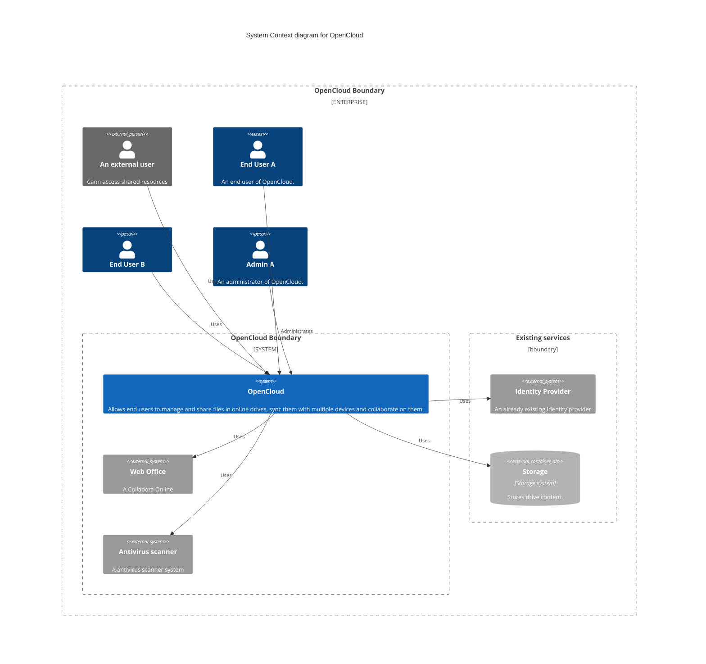
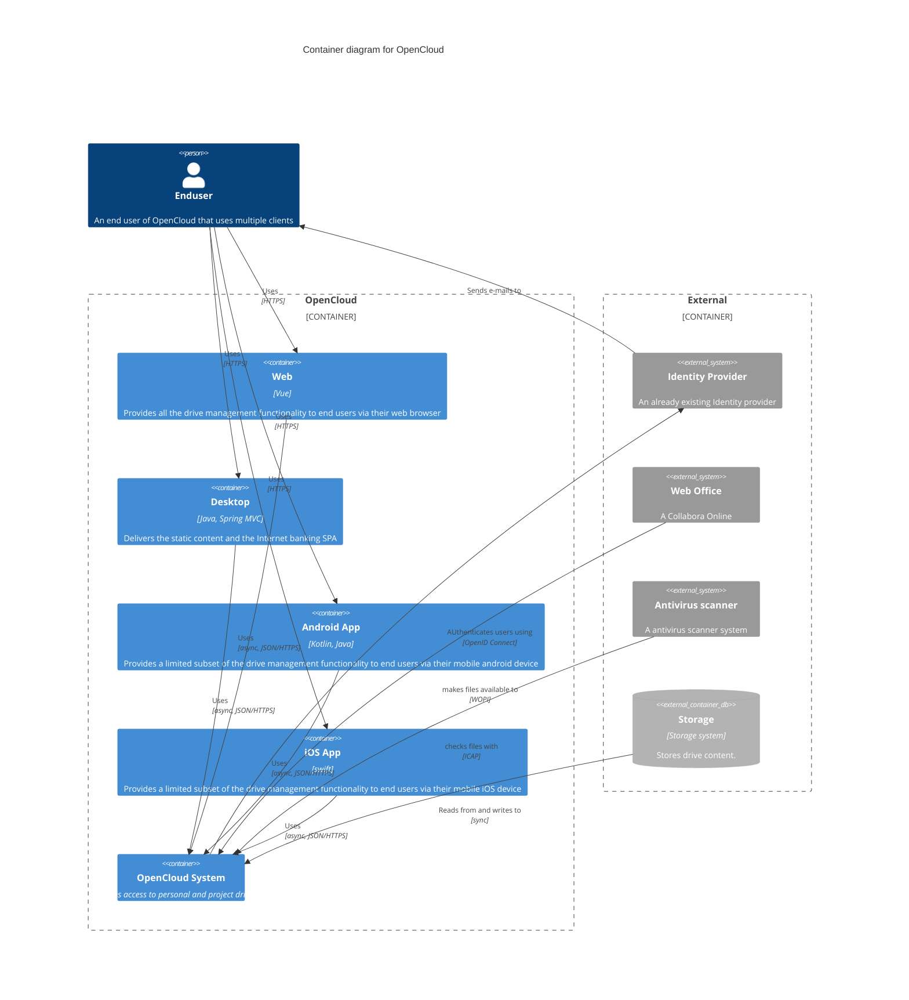
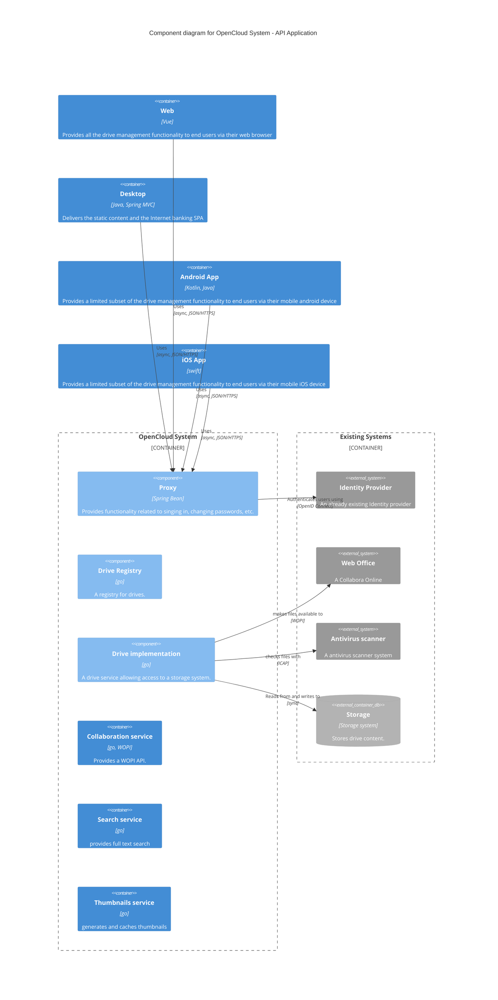
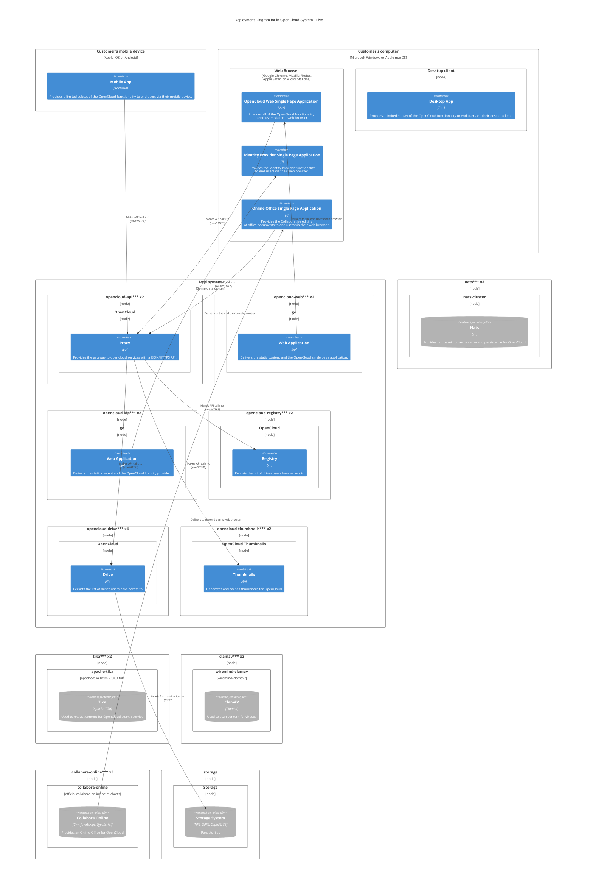

# Revisiting opencloud architecture

## Basic functionality
At the lowest level, the core functionality of opencloud allows users to upload files into online drives and sync them with multiple devices. At this level no sharing is invoelved, but it already solves a well understood problem.

### Architecture
We have a proxy (should be our api gateway) that authenticates users (adds traces, logs requests etc) and creates an internal JWT for further authentication in the backend services (although we might still have to forward the original auth headers). The backend consists of a directory of drives the user has access to as well as a service that implements the actual strorage access.

#### System Context diagram for OpenCloud

#### Container diagram for OpenCloud

#### Component diagram for OpenCloud

#### Deployment I am aiming for

For security reasons we want to run any service that has to examine user provided content to run in a dedicated container. This happens when processing a file for e.g. thumbnail generation, context extraction by tika for full text search, antivirus scanning and any online office.

- [ ] TODO where is ldap in here? do we need it for our own account management? maybe a SCIM based service?

#### deployment we can currently do without changing code

```mermaid
    C4Deployment
    title Deployment Diagram for in OpenCloud System - Live

    Deployment_Node(mob, "Customer's mobile device", "Apple IOS or Android"){
        Container(mobile, "Mobile App", "Xamarin", "Provides a limited subset of the OpenCloud functionality to end users via their mobile device.")
    }

    Deployment_Node(comp, "Customer's computer", "Microsoft Windows or Apple macOS"){
        Deployment_Node(browser, "Web Browser", "Google Chrome, Mozilla Firefox,<br/> Apple Safari or Microsoft Edge"){
            Container(web-spa, "OpenCloud Web Single Page Application", "Vue", "Provides all of the OpenCloud functionality<br/>  to end users via their web browser.")
            Container(idp-spa, "Identity Provider Single Page Application", "?", "Provides the Identity Provider functionality<br/>  to end users via their web browser.")
            Container(office-spa, "Online Office Single Page Application", "?", "Provides the Collaborative editing<br/>  of office  documents to end users via their web browser.")
        }
        Deployment_Node(desk, "Desktop client"){
            Container(desktop, "Desktop App", "C++", "Provides a limited subset of the OpenCloud functionality to end users via their desktop client.")
        }
    }

    Deployment_Node(k3s, "Deployment", "Some data center"){

        Deployment_Node(oa, "opencloud-api*** x2"){
            Deployment_Node(opencloud-api, "OpenCloud"){
                Container(proxy, "Proxy", "go", "Provides the gateway to opencloud services with a JSON/HTTPS API.")
            }
        }

        Deployment_Node(or, "opencloud-registry*** x2"){
            Deployment_Node(opencloud-registry, "OpenCloud"){
                %% HTTP but serving mostly static constent
                Container(web, "Web Application", "go", "Delivers the static content and the OpenCloud single page application.")
                %% I'd prefer to replace this with a dedicated idp project ... authelia / authentic?
                Container(idp, "Web Application", "go", "Delivers the static content and the OpenCloud Identity provider.")

                %% HTTP services
                Container(frontend, "frontend", "go", "Serves the legacy API endpoints")
                Container(graph, "graph", "go", "Serves the /graph endpoint")
                Container(invitations, "invitations", "go", "Serves the /graph/invitations endpoint, currently unused?")
                Container(ocdav, "ocdav", "go", "Serves the /ocdav endpoint")
                Container(ocm, "ocm", "go", "Serves the /ocm endpoint")
                Container(ocs, "ocs", "go", "Serves the legacy /ocs endpoint")
                Container(sse, "sse", "go", "responsible for sending any server side events")
                Container(webdav, "webdav", "go", "Serves the /webdav endpoint, TODO only needed for what?")
                %% TODO webfinger is only needed for sharded deployments, right?
                Container(webfinger, "webfinger", "go", "Serves the /webfinger endpoint")
                
                %% GRPC services
                Container(app-provider, "cs3 app-provider", "go", "TODO used for what? still necessary? part of collaboration service now?")
                Container(app-registry, "cs3 app-registry", "go", "used to configure the default apps for mimetypes")
                Container(auth-app, "cs3 auth-app", "go, CS3 auth-provider", "used to authenticate apps")
                Container(auth-basic, "cs3 auth-basic", "go, CS3 auth-provider", "used to authenticate users using basic auth for testing")
                Container(auth-bearer, "cs3 auth-bearer", "go, CS3 auth-provider", "used to authenticate users using bearer auth")
                %% TODO we should move the oidc auth to a CS3 auth provider instead of in the proxy? really? the proxy should route the request based on the claims. so how would the proxy decide which backend to route a public link request to in case it was sharded? it would have to query all shards concurrently and then cache the result?
                Container(auth-machine, "cs3 auth-machine", "go, CS3 auth-provider", "used to impersonate users")
                Container(auth-service, "cs3 auth-service", "go, CS3 auth-provider", "used to authenticate services")
                Container(gateway, "cs3 gateway", "go", "Serves the CS3 gateway service")
                Container(groups, "cs3 groups", "go", "provides groups to OpenCloud")
                Container(policies, "cs3 policies", "go", "provides policies to OpenCloud")
                Container(sharing, "cs3 sharing", "go", "provides share management to OpenCloud")
                Container(storage-publiclink, "cs3 storageprovider", "go", "provides public link access to OpenCloud")
                Container(storage-shares, "cs3 storageprovider", "go", "provides share access to OpenCloud")
                %% TODO should this be part of the registry?
                Container(storage-system, "cs3 storageprovider", "go", "provides metadata storage to OpenCloud")
                Container(users, "cs3 users", "go", "provides users to OpenCloud")

                %% GRPC and HTTP services
                Container(collaboration, "collaboration", "go", "TODO")
                Container(settings, "settings", "go", "TODO")

                %% LDAP services
                Container(idm, "idm", "go", "persists accounts for OpenCloud")

                %% servers listening on events
                Container(activitylog, "activitylog", "go", "stores events per resource") 
                %% TODO ref using ICAP
                Container(antivirus, "antivirus", "go", "used to send uploaded files to clamav")
                %% TODO needs a persistence store? S3? or is the log just streamed elsewhere
                Container(audit, "audit", "go", "produces an audit log")  
                %% how are the below services queried?
                Container(clientlog, "clientlog", "go", "stores machine readable events for clients") 
                Container(eventhistory, "eventhistory", "go", "persists all events")
                Container(postprocessing, "postprocessing", "go", "handles the coordination of asynchronous postprocessing steps")
                %% search has a GRPC API
                Container(search, "search", "go", "provides search and indexing to OpenCloud")
                Container(userlog, "userlog", "go", "translates and adjusts messages to be human readable") 



            }
        }
        Deployment_Node(od, "opencloud-drive*** x4"){
            Deployment_Node(opencloud-drive, "OpenCloud"){
                Container(drive, "Drive", "go", "Persists the list of drives users have access to")
                Container(storage-users, "cs3 storageprovider", "go", "provides storage spaces to OpenCloud")
            }
        }

        Deployment_Node(ot, "opencloud-thumbnails*** x2"){
            Deployment_Node(opencloud-thumbnails, "OpenCloud Thumbnails"){
                Container(thumbnails, "Thumbnails", "go", "Generates and caches thumbnails for OpenCloud")
            }
        }
        
    }
    
    Deployment_Node(na, "nats*** x3"){
        Deployment_Node(nats-cluster, "nats-cluster"){
            ContainerDb_Ext(nats, "Nats", "go", "Provides raft baset consesus cache and persistence for OpenCloud")
        }
    }

    Deployment_Node(ti, "tika*** x2"){
        Deployment_Node(tika-helm, "apache-tika", "apache/tika-helm v3.0.0-full"){
            ContainerDb_Ext(tika, "Tika", "Apache Tika", "Used to extract content for OpenCloud search service")
        }
    }

    Deployment_Node(cav, "clamav*** x2"){
        Deployment_Node(clamav-helm, "wiremind-clamav", "wiremind/clamav?"){
            ContainerDb_Ext(clamav, "ClamAV", "ClamAV", "Used to scan content for viruses")
        }
    }

    Deployment_Node(collab, "collabora-online*** x3"){
        Deployment_Node(collab-helm, "collabora-online", "official collabora-online helm charts"){
            ContainerDb_Ext(collabora-online, "Collabora Online", "C++, JavaScript, TypeScript", "Provides an Online Office for OpenCloud")
        }
    }

    Deployment_Node(sn, "storage") {
        Deployment_Node(stor, "Storage") {
            ContainerDb_Ext(storage, "Storage System", "NFS, GPFS, CephFS, S3", "Persists files")
        }
    }

    Rel(mobile, proxy, "Makes API calls to", "json/HTTPS")
    Rel(web-spa, proxy, "Makes API calls to", "json/HTTPS")
    Rel(office-spa, proxy, "Makes API calls to", "WOPI/HTTPS")
    Rel_U(web, web-spa, "Delivers to the end user's web browser")
    Rel_U(idp, idp-spa, "Delivers to the end user's web browser")
    Rel_U(collabora-online, office-spa, "Delivers to the end user's web browser")
    
    Rel(proxy, frontend, "Makes API calls to", "json/HTTPS")
    Rel(proxy, drive, "Makes API calls to", "json/HTTPS")
    Rel(proxy, thumbnails, "Makes API calls to", "json/HTTPS")

    Rel(drive, storage, "Reads from and writes to", "JDBC")

    UpdateRelStyle(web-spa, proxy, $offsetY="-40")
    UpdateRelStyle(web, web-spa, $offsetY="-40")
    UpdateRelStyle(drive, storage, $offsetX="-40", $offsetY="-20")
```

