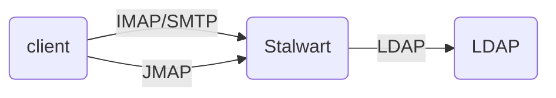
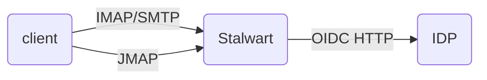
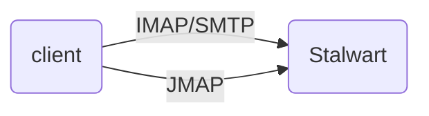
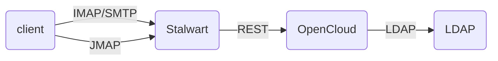
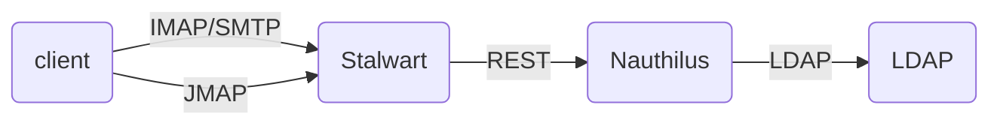
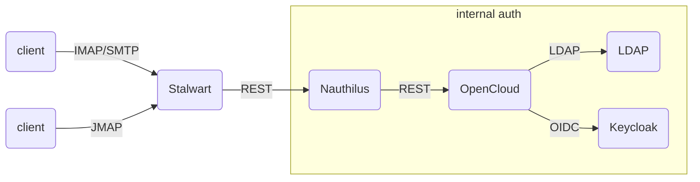

* Status: draft

## Context

In a groupware environment, not every user will always use the OpenCloud UI to read their emails, some will resort to other [MUAs (Mail User Agents)](https://en.wikipedia.org/wiki/Email_client) that support a subset of features, use older protocols (IMAP, POP, SMTP, CalDAV, CardDAV) and lesser authentication methods (basic authentication). Those email clients will talk to Stalwart directly, as opposed to the OpenCloud UI which will make use of APIs of the OpenCloud Groupware service, since those protocols are provided by Stalwart and implementing them in OpenCloud would offer very little benefits, but definitely a lot of (almost completely) unnecessary effort.

Those protocols and operations that bypass the OpenCloud UI also need to be authenticated, this in and by Stalwart, and we need to find the best fitting approach that fulfills most or all of the following constraints:

### Single Provisioning

We want to avoid multiple provisioning of users, groups, passwords and other resources as much as possible.
While it is possible to have e.g. OpenCloud's user management also perform [Management API](https://stalw.art/docs/category/management-api/) calls, one still inevitably ends up in situations where users, user passwords, or other resources are not in sync, which becomes complex to debug and fix, and should thus be avoided if possible.

To do so, we should strive to have a single source of truth regarding users, their passwords, and similar resources and attributes such as groups, roles, application passwords, etc...

### Attack Detection

Coordinated attacks such as [denial of service](https://en.wikipedia.org/wiki/Denial-of-service_attack) attempts don't necessarily focus on a single protocol but are commonly multi-pronged, e.g. by brute forcing the [OIDC API](https://www.keycloak.org/docs/latest/authorization_services/index.html#token-endpoint), the OpenCloud Groupware API, IMAP and SMTP, \*DAV protocols, etc...

In order to detect those as well as to quickly react by blacklisting clients that are identified to attempt such attacks, it is useful to have a single authentication service for all the components of the system, all protocols, all clients (e.g. [PowerDNS Weakforced](https://github.com/PowerDNS/weakforced), [Nauthilus](https://nauthilus.org/), ...)

Furthermore, such services typically make use of [DNSBL/RBL services](https://en.wikipedia.org/wiki/Domain_Name_System_blocklist) that allow IP addresses of botnets to be blocked across many services of many providers as a shared defense mechanism.

As a bonus, a centralized authentication component can also provide metrics and observability capabilities across all those protocols.

### Custom Authentication Implementations

Some customers might want custom authentication implementations to integrate with their environment, in which case we would want those to be done once and in the technology stack we're all most familiar with (thus as a service in Go in the OpenCloud framework, and not e.g. a Lua script in Nauthilus, or a Rust plugin in Stalwart, etc...)

## Decision Drivers

TODO

* 

## Considered Options

First off, here is a brief explanation of each of the scenarios that we potentially or absolutely need to support, which we will explore for each implementation option:

* MUAs with basic authentication
  * these are external mail clients (Thunderbird, Apple Mail, ...) with which users authenticate using legacy protocols (IMAP, POP3, SMTP) and their primary username and password in clear text (encrypted through the mandatory use of TLS)
* MUAs with application password authentication
  * these are external mail clients (Thunderbird, Apple Mail, ...) with which users authenticate using legacy protocols (IMAP, POP3, SMTP) and one of the application passwords that they created in the OpenCloud UI, which is a useful security mechanism as it reduces the attack surface when one such password is leaked or discovered
* MUAs with SASL bearer token authentication
  * these are more modern external mail clients (Thunderbird) with which users authenticate using legacy protocols (IMAP, POP3, SMTP) but more secure OIDC token based authentication (SASL OAUTHBEARER or SASL XOAUTH2), which closely resembles the OIDC authentication used by the OpenCloud UI towards the OpenCloud backends
* JMAP clients with basic authentication
  * modern mail clients (Thunderbird) that speak the JMAP protocol over HTTP and authenticate using their primary username and password in clear text (encrypted through the use of HTTPS)
* JMAP clients with bearer token authentication
  * modern mail clients (Thunderbird) that speak the JMAP protocol over HTTP and authenticate using an OIDC token (JWT) obtained from an IDP (typically KeyCloak)
* OpenCloud Groupware with master authentication
  * the OpenCloud UI client uses APIs from the OpenCloud Groupware backend (and authenticates using OIDC)
  * the OpenCloud Groupware backend, in turn, performs JMAP operations with Stalwart, and authenticates using Stalwart's shared secret master authentication protocol
* OpenCloud Groupware with generated token authentication
  * the OpenCloud UI client uses APIs from the OpenCloud Groupware backend (and authenticates using OIDC)
  * the OpenCloud Groupware backend, in turn, performs JMAP operations with Stalwart, and authenticates against Stalwart using bearer authentication with JWTs that it generates itself
  * in the future, that JWT might also be the JWT that the OpenCloud UI used to authenticate against the OpenCloud Groupware in the first place

### Stalwart with the LDAP Directory

Clients authenticate directly against Stalwart, that is configured to use an LDAP authentication Directory.
An LDAP server (e.g. OpenLDAP) is needed as part of the infrastructure.
OpenCloud also has to make use of the same LDAP server.

* ✅ MUAs with basic authentication
  * MUAs authenticate directly against Stalwart
  * Stalwart's LDAP Directory plugin supports plain text authentication by looking up the userPassword attribute in the LDAP server
* ❌ MUAs with application password authentication
  * MUAs authenticate directly against Stalwart
  * Stalwart's LDAP Directory plugin does not support application password as it is hardwired to look up the password in the userPassword attribute in the LDAP server
  * even if it did support looking up alternative passwords in LDAP, this would hardly be practical as the application passwords are currently created and stored in OpenCloud, which would need to be modified to store them in LDAP in the first place
* ❌ MUAs with SASL bearer token authentication
  * MUAs authenticate directly against Stalwart
  * Stalwart's LDAP Directory plugin does not support verifying OIDC tokens
* ✅ JMAP clients with basic authentication
  * JMAP clients authenticate directly against Stalwart
  * Stalwart's LDAP Directory plugin supports plain text authentication by looking up the userPassword attribute in the LDAP server
* ❌ JMAP clients with bearer token authentication
  * JMAP clients authenticate directly against Stalwart
  * Stalwart's LDAP Directory plugin does not support verifying OIDC tokens
* ✅ OpenCloud Groupware with master authentication
  * the OpenCloud Groupware backend authenticates directly against Stalwart
  * Stalwart detects and supports clear text password master authentication regardless of the Directory that is being used, and verifies it against the shared secret password that is configured in the server
* ❌ OpenCloud Groupware with generated token authentication
  * the OpenCloud Groupware backend authenticates directly against Stalwart
  * Stalwart's LDAP Directory plugin does not support verifying OIDC tokens

### Stalwart with the OIDC Directory

Clients authenticate directly against Stalwart, that is configured to use an OIDC authentication Directory.
An OIDC IDP (server) is needed as part of the infrastructure, e.g. KeyCloak.
Optionally, an LDAP server (e.g. OpenLDAP) might be used as well, and KeyCloak would look up users and their credentials in LDAP.

OpenCloud also has to make use of the same LDAP server, or would need to be modified to be capable of only making use of an OIDC IDP (which would include limitations that are yet to be resolved, e.g. the option of using KeyCloak Admin APIs to retreieve groups, group members, ...)

* ❌ MUAs with basic authentication
  * MUAs authenticate directly against Stalwart
  * Stalwart's OIDC Directory plugin does not support plain text authentication
* ❌ MUAs with application password authentication
  * MUAs authenticate directly against Stalwart
  * Stalwart's OIDC Directory plugin does not support application passwords
* ❓ MUAs with SASL bearer token authentication
  * MUAs authenticate directly against Stalwart
  * Stalwart's OIDC Directory plugin does not currently support external IDPs, but is expected to in future versions
  * as of Stalwart 0.12, this would only work if Stalwart itself is used as the IDP when acquiring a token
* ❌ JMAP clients with basic authentication
  * JMAP clients authenticate directly against Stalwart
  * Stalwart's OIDC Directory plugin does not support plain text authentication
* ❓ JMAP clients with bearer token authentication
  * JMAP clients authenticate directly against Stalwart
  * Stalwart's OIDC Directory plugin does not currently support external IDPs, but is expected to in future versions
  * as of Stalwart 0.12, this would only work if Stalwart itself is used as the IDP when acquiring a token
* ✅ OpenCloud Groupware with master authentication
  * the OpenCloud Groupware backend authenticates directly against Stalwart
  * Stalwart detects and supports clear text password master authentication regardless of the Directory that is being used, and verifies it against the shared secret password that is configured in the server
* ❓ OpenCloud Groupware with generated token authentication
  * the OpenCloud Groupware backend authenticates directly against Stalwart
  * Stalwart's OIDC Directory plugin does not currently support external IDPs, but is expected to in future versions
  * as of Stalwart 0.12, this would only work if Stalwart itself is used as the IDP when acquiring a token, which is not the case with this approach as the tokens are generated by the Groupware backend itself

### Stalwart with the Internal Directory

Clients authenticate directly against Stalwart, that is configured to use an Internal authentication Directory.
Neither an OIDC IDP nor an LDAP server are needed as part of the infrastructure, as principal resources (users, groups) and their credentials exist in Stalwart's storage.

OpenCloud would not be capable of accessing those resources, which means that provisioning of groups, users, user passwords must be duplicated and kept in sync between Stalwart and OpenCloud.

* ✅ MUAs with basic authentication
  * MUAs authenticate directly against Stalwart
  * Stalwart's Internal Directory plugin supports plain text authentication
* ✅ MUAs with application password authentication
  * MUAs authenticate directly against Stalwart
  * Stalwart's Internal Directory plugin supports application passwords
  * users are able to create those themselves using the self-service web UI of Stalwart
  * they are not shared with the OpenCloud application passwords though and would need to be provisioned into Stalwart when created in OpenCloud to provide a single UI
* ❌ MUAs with SASL bearer token authentication
  * MUAs authenticate directly against Stalwart
  * Stalwart's Internal Directory plugin does not support OIDC token authentication
* ✅ JMAP clients with basic authentication
  * JMAP clients authenticate directly against Stalwart
  * Stalwart's Internal Directory plugin supports plain text authentication
* ❌ JMAP clients with bearer token authentication
  * JMAP clients authenticate directly against Stalwart
  * Stalwart's Internal Directory plugin does not support OIDC token authentication
* ✅ OpenCloud Groupware with master authentication
  * the OpenCloud Groupware backend authenticates directly against Stalwart
  * Stalwart detects and supports clear text password master authentication regardless of the Directory that is being used, and verifies it against the shared secret password that is configured in the server
* ❌ OpenCloud Groupware with generated token authentication
  * the OpenCloud Groupware backend authenticates directly against Stalwart
  * Stalwart's Internal Directory plugin does not support OIDC token authentication

### Stalwart with the OpenCloud Authentication API

Clients authenticate directly against Stalwart, that is configured to use an "External" authentication Directory, that is yet to be developed. (warning)
Its protocol is currently not defined, but not particularly relevant at this time, as long as it supports accepting basic and bearer authentication in order to authenticate both username and password credentials as well as OIDC tokens.

That External Directory implementation forwards the basic or bearer credentials to an endpoint in the OpenCloud backend, that the responds with whether the authentication is successful or not, as well as with additional information that is needed for Stalwart (email address, display name, groups, roles, ...)

* ✅ MUAs with basic authentication
  * MUAs authenticate directly against Stalwart
  * Stalwart's External Directory supports plain text authentication by relaying the authentication operation to the OpenCloud backend, which can then authenticate users by username and password using an LDAP server
  * note that this option requires having an LDAP server in the environment, including having it accessible by OpenCloud
  * if that is not the case, then a viable option is also to support OIDC tokens and application passwords
  * to clarify: this scenario is only about supporting authentication using the "primary" username and password
* ✅ MUAs with application password authentication
  * MUAs authenticate directly against Stalwart
  * Stalwart's External Directory supports application password authentication by relaying the authentication operation to the OpenCloud backend, which can then authenticate against its list of application passwords
  * this is the ideal scenario for application passwords, since they are already supported by OpenCloud, and can be created and managed using the OpenCloud UI
  * relaying the authentication operation to OpenCloud also prevents the need for duplicate provisioning of application passwords
* ✅ MUAs with SASL bearer token authentication
  * MUAs authenticate directly against Stalwart
  * Stalwart's External Directory supports OIDC token authentication by relaying the authentication operation to the OpenCloud backend, which can then either perform local token inspection and authentication by verifying the token's signature, or use the OIDC IDP's token introspection endpoint
* ✅ JMAP clients with basic authentication
  * JMAP clients authenticate directly against Stalwart
  * Stalwart's External Directory supports plain text authentication by relaying the authentication operation to the OpenCloud backend, which can then authenticate users by username and password using an LDAP server
  * the same limitations/requirements as for the "MUAs with basic authentication" scenario apply here as well
* ✅ JMAP clients with bearer token authentication
  * MUAs authenticate directly against Stalwart
  * Stalwart's External Directory supports OIDC token authentication by relaying the authentication operation to the OpenCloud backend, which can then either perform local token inspection and authentication by verifying the token's signature, or use the OIDC IDP's token introspection endpoint
* ✅ OpenCloud Groupware with master authentication
  * the OpenCloud Groupware backend authenticates directly against Stalwart
  * Stalwart detects and supports clear text password master authentication regardless of the Directory that is being used, and verifies it against the shared secret password that is configured in the server
* ✅ OpenCloud Groupware with generated token authentication
  * the OpenCloud Groupware backend authenticates directly against Stalwart
  * in the worst case, the External Directory plugin in Stalwart would also perform a forwarding of the authentication operation to OpenCloud, which would obviously be able to verify a token it has created
  * an optimization might be possible here, if the External Directory implementation permits for the configuration of specific issuers which should then be verifying against a JWK set directly, whereas the fallback behaviour would be to query the OpenCloud Authentication API

### Stalwart with Nauthilus and LDAP

In this scenario, we introduce the [Nauthilus authentication service](https://nauthilus.org/), which has its own API but also a KeyCloak integration plugin.
It supports various backends and can also be scripted for more complex combinations.

⚠️ It would require the implementation of a Stalwart Nauthilus Directory, **that is yet to be developed**.

We do not make use of any OpenCloud Authentication API but, instead, attempt to have everything go through Nauthilus instead, backed by an LDAP server that then contains the users, groups, and user passwords.

The upside of using Nauthilus is that it does brute force attack detection and can provide metrics across multiple protocols and clients in a centralized fashion.

* ✅ MUAs with basic authentication
  * MUAs authenticate directly against Stalwart
  * Stalwart's Nauthilus Directory supports plain text authentication by relaying the authentication operation to Nauthilus, e.g. using its JSON API
  * Nauthilus provides a response that contains user attributes from LDAP (display name, email addresses, ...)
* ❓ MUAs with application password authentication
  * Nauthilus has no support for application passwords in itself
  * a Lua plugin could potentially be used in Nauthilus to detect whether the clear text password matches a regular expression for application passwords and, if that is the case, first attempt to verify it through an API call (that does not exist yet) to the OpenCloud backend, but that would definitely be more complex and less elegant than having a single API
* ❓ MUAs with SASL bearer token authentication
  * it is currently unclear whether Nauthilus supports OIDC token authentication
* ✅ JMAP clients with basic authentication
  * Stalwart's Nauthilus Directory supports plain text authentication by relaying the authentication operation to Nauthilus, e.g. using its JSON API
  * Nauthilus provides a response that contains user attributes from LDAP (display name, email addresses, ...)
* ❓ JMAP clients with bearer token authentication
  * it is currently unclear whether Nauthilus supports OIDC token authentication
* ✅ OpenCloud Groupware with master authentication
  * the OpenCloud Groupware backend authenticates directly against Stalwart
  * Stalwart detects and supports clear text password master authentication regardless of the Directory that is being used, and verifies it against the shared secret password that is configured in the server
* ❓ OpenCloud Groupware with generated token authentication
  * the OpenCloud Groupware backend authenticates directly against Stalwart
  * it is currently unclear whether Nauthilus supports OIDC token authentication
  * an optimization might be possible here, if the Nauthilus Directory implementation permits for the configuration of specific issuers which should then be verifying against a JWK set directly, whereas the fallback behaviour would be to query the Nauthilus API, but that does sound like a stretch to fit into the concept

### Stalwart with Nauthilus and an OpenCloud Authentication API

This option also makes use of the [Nauthilus authentication service](https://nauthilus.org/), but instead of it using LDAP to resolve users, we would either make use of its Lua scripting abilities to implement a backend that performs HTTP calls to an OpenCloud Authentication API, or implement an additional Nauthilus backend that uses the Nauthilus API to delegate to another instance, which would then be the OpenCloud Authentication API with support for the Nauthilus API.

⚠️ As with the previous option, it would require the implementation of a Stalwart Nauthilus Directory, **that is yet to be developed**.

Interestingly, if the OpenCloud Authentication API follows the Nauthilus API, this scenario can easily be degraded by dropping Nauthilus and, instead, having all services talk to the OpenCloud Authentication API directly.

* ✅ MUAs with basic authentication
  * MUAs authenticate directly against Stalwart
  * Stalwart's Nauthilus Directory supports plain text authentication by relaying the authentication operation to Nauthilus, e.g. using its JSON API
  * Nauthilus provides a response that contains user attributes from LDAP (display name, email addresses, ...)
* ✅ MUAs with application password authentication
  * Nauthilus would forward the authentication request to the OpenCloud Authentication API, which would support application passwords
* ❓ MUAs with SASL bearer token authentication
  * it is currently unclear whether Nauthilus supports OIDC token authentication and whether it would be able to forward such requests to the OpenCloud Authentication API
* ✅ JMAP clients with basic authentication
  * Stalwart's Nauthilus Directory supports plain text authentication by relaying the authentication operation to Nauthilus, e.g. using its JSON API
  * Nauthilus then forwards that request to the OpenCloud Authentication API
  * the OpenCloud Authentication API, and then Nauthilus, provides a response that contains user attributes from LDAP (display name, email addresses, ...) or claims from the JWT
* ❓ JMAP clients with bearer token authentication
  * it is currently unclear whether Nauthilus supports OIDC token authentication and whether it would be able to forward such requests to the OpenCloud Authentication API
* ✅ OpenCloud Groupware with master authentication
  * the OpenCloud Groupware backend authenticates directly against Stalwart
  * Stalwart detects and supports clear text password master authentication regardless of the Directory that is being used, and verifies it against the shared secret password that is configured in the server
* ❓ OpenCloud Groupware with generated token authentication
  * the OpenCloud Groupware backend authenticates directly against Stalwart
  * it is currently unclear whether Nauthilus supports OIDC token authentication and whether it would be able to forward such requests to the OpenCloud Authentication API

> [!IMPORTANT]
> We need to clarify whether the Nauthilus API allows for a JWT to be submitted for the authentication request, and not only username and password – not to secure the request in itself, but to forward an OIDC token based authentication attempt as part of the payload.

### Comparing Options

| | MUA basic | MUA app password | MUA sasl | JMAP clients with basic auth | JMAP clients with JWT auth | Groupware Middleware with master auth | Groupware Middleware with JWT auth |
| --- | --- | --- | --- | --- | --- | --- | --- |
| Stalwart 0.12 with LDAP Directory | ✅ MUA → Stalwart | ❌ not supported with LDAP | ❌ not supported with LDAP | ✅ | ❌ | ✅ | ❌ |
| Stalwart 0.12 with OIDC Directory | ❌ | ❌ | ❌ | ❌ | ✅ | ✅ | ❌ |
| Stalwart 0.12 with Internal Directory | ✅ MUA → Stalwart, must be provisioned in Stalwart | ✅ MUA → Stalwart, must be provisioned in Stalwart | ❌ | ❌ | ❌ unless using Stalwart as IDP | ✅ | ❌ |
| Stalwart + OpenCloud Authentication API | ✅ MUA → Stalwart → OpenCloud | ✅ MUA → Stalwart → OpenCloud | ✅ MUA → Stalwart → OpenCloud | ✅ MUA → Stalwart → OpenCloud | ✅ MUA → Stalwart → OpenCloud | ✅ | ✅ |
| Stalwart + Nauthilus + LDAP | ✅ MUA → IMAP proxy → Nauthilus → LDAP | ❌ | ❌ | ✅ | ❌ | ✅ | ❌ |
| Stalwart + Nauthilus + OpenCloud Authentication API | ✅ MUA → IMAP proxy → Nauthilus → OpenCloud | ✅ MUA → IMAP proxy → Nauthilus → OpenCloud | ✅ MUA → IMAP proxy → Nauthilus → OpenCloud | ✅ MUA → IMAP proxy → Nauthilus → OpenCloud | ✅ MUA → IMAP proxy → Nauthilus → OpenCloud | ✅ | ✅ |
| Stalwart + Nauthilus-like OpenCloud Authentication API | ✅ MUA → Stalwart → OpenCloud | ✅ MUA → Stalwart → OpenCloud | ✅ MUA → Stalwart → OpenCloud | ✅ MUA → Stalwart → OpenCloud | ✅ MUA → Stalwart → OpenCloud | ✅ | ✅ |
