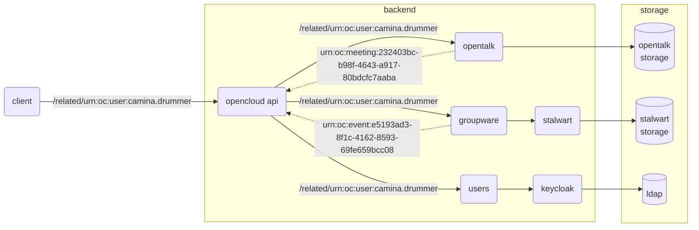

* Status: draft

## Context

Which semantic and technical approach to take in order to provide strong integration of the various products and capabilities of OpenCloud, OpenTalk, and potentially other products as well?

## Decision Drivers

* a strong integration that allows users to access resources and relationships without having to switch views, which translates into a "mental switch" as well
* an innovative approach that differs from the traditional way groupware applications have been designed in the past
* TODO more decision drivers from PM
* a model that is open and generic enough to integrate many different types of resources and relationships
* a model that allows for independent and incremental upgrades to the resources and relationships that can be contributed by each service

## Considered Options

* resource linking
* application launchers
* TODO? can we come up with more ideas?

## Decision Outcome

TODO

### Consequences

TODO

### Confirmation

TODO

## Pros and Cons of the Options

### Resource Linking

This concept primarily resides on the idea of having resources, which have attributes, and relations between them, pretty much as [RDF (Resource Description Framework)](https://www.w3.org/RDF/) does, where the Groupware backend provides services to explore relations of a given resource.

* good: decoupling of UI, backends as well as other participants, as backends can gradually evolve the relationships and resources they understand and can contribute to over time, as well as for the UI that may just silently ignore resources it does not support yet or does not want to present to the user
* good: potential for an asynchronous architecture that would enable the UI to present some resources early without having to wait for those that require more processing time or are provided by services that happen to be under heavier load
* good: it should provide ammunition for a modern and original UI that is centered around resources and relationships rather than the usual visual paradigms
* bad: it might be a challenge to implement this approach in a performant way with rapid response times, as it could cause additional complexity and storage services (e.g. to denormalize reverse indexes, cache expensive resource graphs, etc...)

#### URNs

Each resource has a unique identifier, for which [URNs (Uniform Resource Names)](https://www.rfc-editor.org/rfc/rfc1737) seem the best representation.

URNs are composed of

* a namespace identifier
* a namespace-specific string

As a convention, we will use the following:

<table>
    <thead>
        <tr>
            <th><code>urn:</code></th>
            <th>ns</th>
            <th colspan="2">namespace specific string</th>
        </tr>
    </thead>
    <tbody>
        <tr>
            <td><code>urn:</code></td>
            <td><code>oc:</code></td>
            <td><code>&lt;type&gt;:</code></td>
            <td><code>&lt;unique identifier&gt;:</code></td>
        </tr>
    </tbody>
</table>

##### Examples

<table>
    <thead>
        <tr>
            <th><code>urn:</code></th>
            <th>namespace</th>
            <th>type</th>
            <th>unique id</th>
        </tr>
    </thead>
    <tbody>
        <tr>
            <td><code>urn:</code></td>
            <td><code>oc:</code></td>
            <td><code>user:</code></td>
            <td><code>camina.drummer</code></td>
        </tr>
        <tr>
            <td><code>urn:</code></td>
            <td><code>oc:</code></td>
            <td><code>contact:</code></td>
            <td><code>klaes.ashford</code></td>
        </tr>
        <tr>
            <td><code>urn:</code></td>
            <td><code>oc:</code></td>
            <td><code>event:</code></td>
            <td><code>dd4ea520-e414-41e1-b545-b1c7d4ce57e7</code></td>
        </tr>
        <tr>
            <td><code>urn:</code></td>
            <td><code>oc:</code></td>
            <td><code>mail:</code></td>
            <td><code>&lt;1e8074e8-cd56-4358-9f9e-f17cb701b950@opa.org&gt;</code></td>
        </tr>
    </tbody>
</table>

#### Exploration API

Whenever the user puts a resource into focus in the OpenCloud Groupware UI (i.e. by selecting/clicking that resource, e.g. the sender of an email), it may send a request to the Groupware service API to inquire about related resources.

What those related resources are still stands to be determined, but examples could be along the lines of

* unread emails from the same sender
* emails exchanged with that sender in the last 7 days
* files recently shared with that user
* spaces or groups in common with that user
* OpenTalk meetings planned within the next 3 days

In order to decouple the Groupware service from which resources and relations are supported,

* whenever such an exploration request is received, the Groupware service forwards it to all known services, in a "fan-out" model
* each service can understand the focused resource, or not, but if it does it may return related resources that it is capable of providing using its data model (e.g. OpenTalk providing related meeting resources, OpenCloud Groupware providing related calendar events, contacts, mails, etc...)
* ideally, that happens in an asynchronous fashion, using e.g. [SSE (Server Side Events)](https://developer.mozilla.org/en-US/docs/Web/API/Server-sent_events/Using_server-sent_events) to push results to the OpenCloud UI to avoid having to wait for the slowest contributor, although that pushes the "reduce" part of this ["map-reduce" operation](https://en.wikipedia.org/wiki/MapReduce) to the client



This allows a decoupling of all the participants, enabling each service to add, remove or alter relationships that it is able to contribute for a given resource type.

Obviously, the UI needs to be able to understand resource types to know how to represent them, but if it silently ignores resource types that it does not know of, backends can evolve independently from the UI.

#### JSON-LD

[JSON-LD (JSON for Linking Data)](https://json-ld.org/) seems like a potent representation format for those relationships in a REST environment.

It could look something like this:

```json
{
    "@context": {
        "@user": "https://schema.opencloud.eu/user.jsonld",
        "link": "https://schema.opencloud.eu/linked.jsonld"
    },
    "@type": "urn:oc:type:user",
    "@id": "urn:oc:user:cdrummer",
    "name": "Camina Drummer",
    "email": "camina@opa.org",
    "roles": ["admin", "pirate"],
    "link:rooms": [
        {
            "@context": {
                "@room": "https://meta.opencloud.eu/room.jsonld",
                "link": "https://schema.opencloud.eu/linked.jsonld"
            },
            "@id": "urn:oc:room:a3f19df6-6c7d-45fa-b16c-6e168e2a2a43",
            "name": "OPA Leadership Standup 2355-02-27",
            "start": "2355-02-27T10:58:15.918Z",
            "end": "2355-02-27T13:52:59.010Z",
            "started_by": {
                "@context": "https://meta.opencloud.eu/user.jsonld",
                "@type": "urn:oc:type:user",
                "@id": "urn:oc:user:adawes",
                "name": "Anderson Dawes",
                "email": "anderson@opa.org"
            },
            "link:events": [
                {
                    "@context": "https://meta.opencloud.eu/event.jsonld",
                    "@type": "urn:oc:type:event",
                    "@id": "urn:oc:event:3e041c88-088c-4015-a32e-5560561f6e26",
                    "start": "2355-02-27T11:09:15.918Z",
                    "end": "2355-02-27T13:52:59.010Z",
                    "status": "confirmed",
                    "invited": [
                        {
                            "@context": "https://meta.opencloud.eu/user.jsonld",
                            "@type": "urn:oc:type:user",
                            "@id": "urn:oc:user:adawes",
                            "name": "Anderson Dawes",
                            "email": "anderson@opa.org"
                        },
                        {
                            "@context": "https://meta.opencloud.eu/user.jsonld",
                            "@type": "urn:oc:type:user",
                            "@id": "urn:oc:user:kashford",
                            "name": "Klaes Ashford",
                            "email": "klaes@opa.org"
                        }
                    ]
                }
            ],
            "members": [
                {
                    "@context": "https://meta.opencloud.eu/contact.jsonld",
                    "@type": "urn:oc:type:contact",
                    "@id": "urn:oc:contact:9ccb247d-a728-4d8f-9259-c28cf6cef567",
                    "name": "Naomi Nagata",
                    "email": "naomo@opa.org"
                },
                {
                    "@context": "https://meta.opencloud.eu/user.jsonld",
                    "@type": "urn:oc:type:user",
                    "@id": "urn:oc:user:adawes",
                    "name": "Anderson Dawes",
                    "email": "anderson@opa.org"
                },
                {
                    "@context": "https://meta.opencloud.eu/user.jsonld",
                    "@type": "urn:oc:type:user",
                    "@id": "urn:oc:user:kashford",
                    "name": "Klaes Ashford",
                    "email": "klaes@opa.org"
                }
            ],
            "chat": {
                "@context": "https://meta.opencloud.eu/file.jsonld",
                "@type": "urn:oc:type:file",
                "@id": "urn:oc:file:OPA:chatlogs/2355/02/27/a3f19df6-6c7d-45fa-b16c-6e168e2a2a43.md",
                "href": "https://cloud.opencloud.eu/spaces/OPA/chatlogs/2355/02/27/a3f19df6-6c7d-45fa-b16c-6e168e2a2a43.md"
            }
        }
    ],
    "link:mails": [
        {
            "@context": "https://meta.opencloud.eu/mail.jsonld",
            "@type": "urn:oc:type:mail",
            "@id": "583b9b66-c0b3-41ba-bf6c-a02ec5f4a638@smtp-07.opa.org",
            "subject": "About bosmang Fred Johnson",
            "date": "2355-01-03T09:39:44.919Z"
        },
        ...
    ],
    "link:shares": [
        {
            "@context": "https://meta.opencloud.eu/share.jsonld",
            "@type": "urn:oc:type:share",
            "@id": "841ef259-584d-4ce6-827f-b53f900c988d",
            "filename": "remember the cant.jpg"
        }
    ]
}
```

### Application Launchers

Have a UI that is comprised of multiple more-or-less separate applications, with an application launcher bar, with each application being an icon in itself in that launcher.

Similar to what e.g. Google does, or Open-Xchange App Suite.

* bad: does not make for an integrated application paradigm since users still have to context switch between those applications/views to perform tasks

