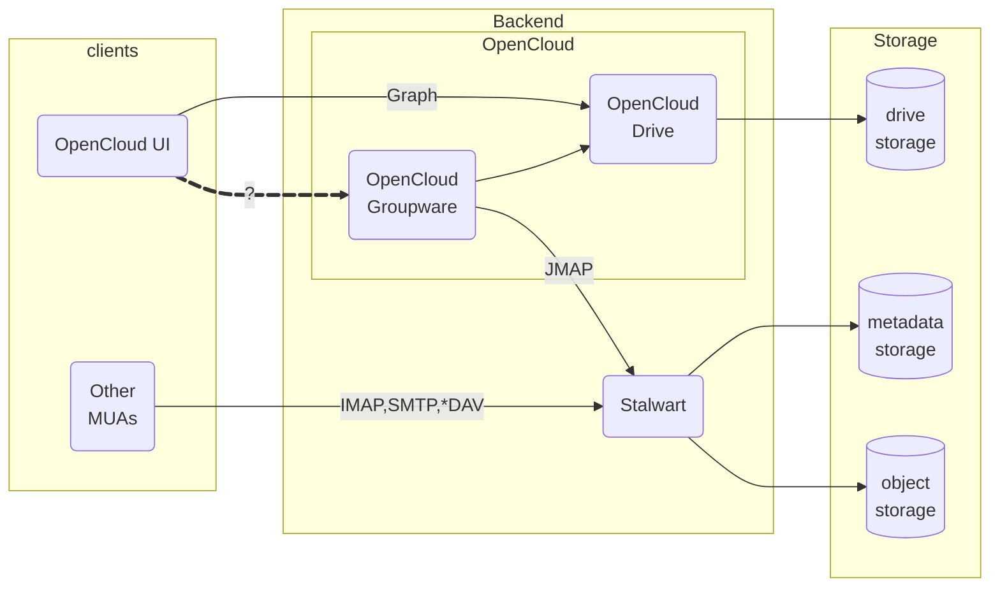
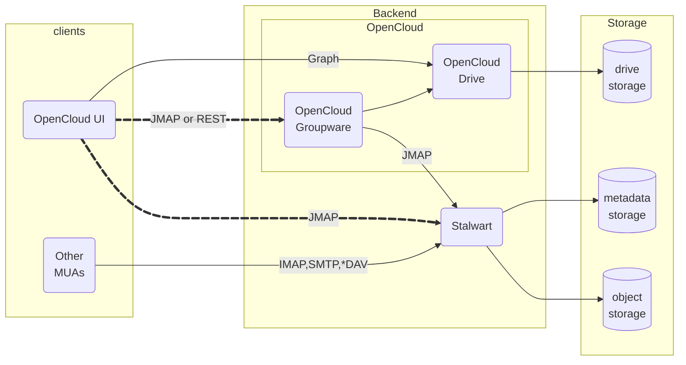
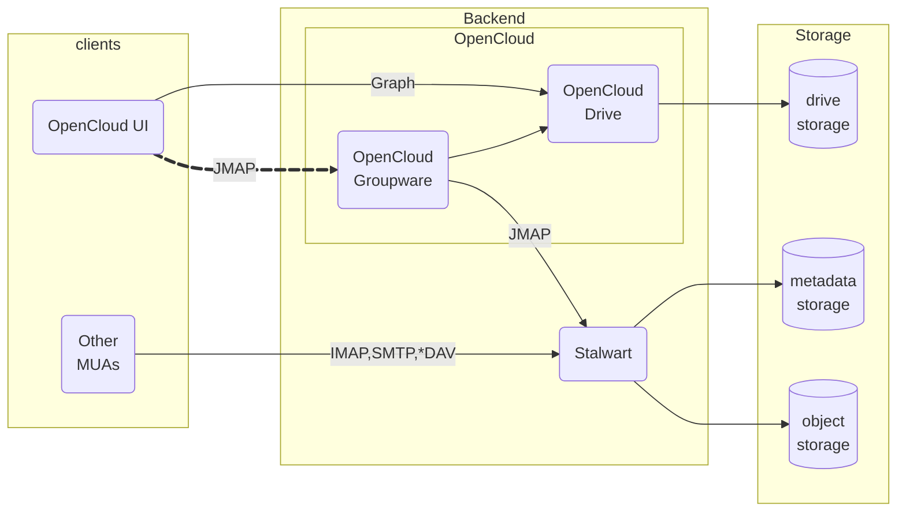

<!-- markdownlint-disable-file MD024 MD033 -->

## Context

We need a comprehensive HTTP API for the OpenCloud Web UI to provide access to the following (upcoming) modules and Groupware functionalities:

* Mail
* Contacts
* Calendar
* Tasks
* Chat
* Configuration



Additionally, the API must also be able to provide information about related resources and their relationships, as outlined in [the Resource Linking ADR](./0003-groupware-resource-linking.md).

For the OpenCloud Drive services, the communication between UI client and backend services is performed via the [LibreGraph API](https://github.com/opencloud-eu/libre-graph-api), which is based on [Microsoft Graph](https://developer.microsoft.com/en-us/graph). The goal of this ADR is **not** to question or change that decision, and the choice of an option is merely for the communication with the Groupware backend.

Communication between the OpenCloud Groupware and Stalwart will make use of the [JMAP (JSON Meta Application Protocol) protocol](https://jmap.io/spec-mail.html).

The API for the OpenCloud Web UI is **not** supposed to be an abstraction of that and thus may use JMAP data formats.

Other [MUAs (Mail User Agents)](https://en.wikipedia.org/wiki/Email_client) converse directly with Stalwart using [IMAP](https://en.wikipedia.org/wiki/Internet_Message_Access_Protocol) or [POP3](https://en.wikipedia.org/wiki/Post_Office_Protocol), [SMTP](https://en.wikipedia.org/wiki/Simple_Mail_Transfer_Protocol), [CalDAV](https://en.wikipedia.org/wiki/CalDAV), [CardDAV](https://en.wikipedia.org/wiki/CardDAV), or JMAP itself.

This ADR concerns the decision regarding which API approach/process/technology/specification to use, not the details of the data model and such, which will need to be fleshed out following the requirements and priorities of the OpenCloud UI Client development, regardless of the selected approach.

## Decision Drivers

### UI Driven

The decision must be significantly driven by the OpenCloud UI Client developers, since they are the primary consumers of the API.

They will also be the sole consumers for a foreseeable while until the OpenCloud Groupware UI reaches a stable feature-complete milestone, which is the earliest point in time for the APIs to be considered stable as well and potentially be consumed by third parties.

Backend developers are stakeholders in that aspect as well though, as the choice of API approach has an impact on the complexity, costs and maintainability of the backend services as well.

### Economic Awareness

Reduction of complexity and implementation efforts, albeit not at all costs, and not only on the short run.

It is obviously of advantage when an option requires less implementation, or less complexity in its implementation.

### Efficiency

Regarding efficiency, the goal is to design an API that is tailored to providing responsiveness ([pagination](https://apisyouwonthate.com/blog/api-design-basics-pagination/), [SSEs (Server-Side Events)](https://developer.mozilla.org/en-US/docs/Web/API/Server-sent_events/Using_server-sent_events), ...) and good network performance.

The latter is achieved by minimizing the number of roundtrips between the client and the servers, which, in turn, is typically achieved through the use of higher level APIs as opposed to a granular API that provides more flexibility but also, by its very nature, requires the combination of multiple request-response roundtrips over the wire.

### Third Party Consumption

We are assuming that the APIs are public APIs (not just technically) and may be consumed by SDKs and third parties.

Implications are that care must be put into providing an API that is stable, versioned, has a changelog, and potentially provided as a product with [LTS (Long-term Support)](https://en.wikipedia.org/wiki/Long-term_support) options.

This also hints at the necessity of a capability exchange/discovery protocol between clients and the Groupware backend, as we will have different versions of clients and servers in the wild, and they need to be able to understand each other. Crucially, if locally running clients are developed, they can go a long time without being updated.

## Considered Options

* [LibreGraph](#libregraph)
* [JMAP](#jmap)
* [custom REST API](#custom-rest-api) (albeit potentially based on standards, at least partially)

## Decision Outcome

The decision was made to go with the custom REST implementation option, mainly due to

* the use of LibreGraph providing little benefits
  * if would provide us with a fleshed out API for groupware
  * but we would not implement it fully
  * and it is really an API for Outlook and Exchange, not a generic groupware standard
  * furthermore, a significant blocker is that it does not provide for a way to support multiple accounts for a user
  * the experience of implementing and using the LibreGraph API for the Drive components has made light of some challenges that we would not like to repeat
* using JMAP directly
  * is a very interesting option in terms of standards, as it is an RFC,
  * but we currently see that approach as too risky as per the potential complexity of parsing payloads of JMAP commands and their backreferences, plugging those across commands that must be forwarded as-is to Stalwart and others that need to be handled by the Groupware middleware itself, but also the potential need to reverse engineer the high-level meaning of chained low-level JMAP commands in order to implement enrichment, caches, reverse indexes, etc...
  * however, it might be a better path forward in the future, especially if JMAP becomes a viable option for replacing the current use of LibreGraph as well

### Consequences

* we will need to design an API on our own, from scratch, albeit maximally making use of JMAP data structures
* that API will need to be maintained as a product, with documentation, versioning, LTS

## Pros and Cons of the Options

* [LibreGraph](#proscons-libregraph)
* [JMAP](#proscons-jmap)
* [Custom REST API](#proscons-custom)

### <a id="proscons-libregraph"/>LibreGraph

[LibreGraph](https://github.com/opencloud-eu/libre-graph-api) is an API specification that is heavily inspired by and based on [Microsoft Graph](https://developer.microsoft.com/en-us/graph), of which it is a partial implementation, but also with modifications where necessary.

Example:

```text
GET /v1.0/me/messages?$select=sender,subject&$count=50&$orderby=received
```

#### Good

* is already in use as the API for OpenCloud Drive operations, with a small stack to use it in the OpenCloud Web UI
* provides an API and data model that has already been thought out and used in production (albeit with only few different implementations)

#### Neutral

* does not have to follow the Microsoft Graph API, can be customized to our own needs, but in which case it becomes doubtful that there is any benefit in mimicking the Graph API in the first place if we diverge from it
* there is no compatibility benefit
  * the only MUA that uses the Microsoft Graph API is Microsoft Outlook, and it is not a goal to support Microsoft Outlook as a MUA beyond standard IMAP/SMTP/CalDAV/CardDAV services (and that would be Microsoft Graph, not LibreGraph nor any customizations we would require)
  * we will not implement all of the Microsoft Graph API
  * we will not implement parts of the Microsoft Graph API as-is either, but will require to make modifications
* if there is a requirement for considering that API as a public API for third party integrators, then the API also needs to be documented, maintained, versioned, and kept stable as much as possible (this is neutral because it is a requirement that exists with every option)

#### Bad

* not an easy API to implement
  * although we have libraries that take care of some of the more complex parts, such as parsing [OData](https://www.odata.org/) expressions
  * really only easy to use when backed by a relational database and an object relational mapping framework using [ASP.NET](https://dotnet.microsoft.com/en-us/apps/aspnet) or [JPA](https://en.wikipedia.org/wiki/Jakarta_Persistence)/[Hibernate](https://hibernate.org/)
  * its data model and peculiar interpretation of REST are really not [idomatic](https://en.wikipedia.org/wiki/HATEOAS) at all, and are clearly the result of reverse engineering the capabilities of Microsoft SQL Server and Exchange into a "standard" from the back, and then Microsoft Outlook's features and capabilities from the front
* not tailored to our needs
  * we will most probably have a lot of cases in which we have to twist the Graph API to express what the UI needs
  * will require using complex filters, which then require complex parsing in the backend in order to translate them into JMAP
  * as opposed to directly using an expressive and maximally matching API in the first place
  * we are likely to encounter use-cases that are not covered by the Graph API (especially due to our resource linking approach)
* does not support multiple accounts per user
  * would require the addition of an account parameter, as a query parameter or as part of the path, which would make every URL in the API incompatible with Microsoft Graph
* more implementation effort than JMAP
* the JMAP RFCs already provides a data model, and we would end up converting between them all the time, with incompatibilities (Graph has attributes JMAP doesn't, and the other way around)
* possibly (probably?) more implementation effort than a custom REST API, due to its complexity

#### Decision Drivers

* UI Driven
  * some members the OpenCloud Web Team strongly prefers not to use LibreGraph due to its complexity and to the fact that we would have to reftrofit operations into an existing API that was designed by a third party
  * one upside is that there is already a client stack for performing LibreGraph operations, which could be reused to some degree for the Groupware APIs as well; it does not amount to all that much code though
* Economic Awareness
  * more complexity and more effort as the other options due to the inherent complexity of the specification
  * a data model is already specified in full, which might save us some time on that front
    * although probably not really either since the actual data model we will work with on the backend is prescribed by JMAP, and we will only be looking to map attributes betsween JMAP and LibreGraph
    * the data model is not necessarily thorougly documented either, which will leave room for interpretation, also due to incompatibilities between JMAP and Graph
    * there will be attributes that are defined in JMAP and that we will receive from Stalwart that will not have a corresponding attribute in Graph (or be a list of values as opposed to a single value), and those will require to either lose some data by squashing it into the Graph data model, or extending the Graph data model which renders us incompatible with it
* Efficiency
  * since the API is not tailored to our needs, we are much more likely to end up performing multiple roundtrips for single high level operations
* Third Party Consumption
  * for some of the operations, we could point to the Microsoft Graph documentation, although that would not make for a great experience either, we would probably need to replicate it
  * our deviations and extensions will have to be maintained just like the other options
  * LibreGraph doesn't help with API stability either since
    * we don't implement all of it, and need to document what we implement and what we don't,
    * won't be compatible either due to modifications (additional parameters, unsupported parameters, different interpretations),
    * and will just as equally need to evolve it as the other options, requiring the documentation of changes as well
  * will be required to be maintained as a public API
    * documentation
    * LTS
    * versioning

### <a id="proscons-jmap"/>JMAP

[JMAP (JSON Meta Application Protocol)](https://jmap.io/spec.html) is a set of specifications that are codified in RFCs:

* [RFC 8620](https://tools.ietf.org/html/rfc8620): core JMAP protocol
* [RFC 8261](https://tools.ietf.org/html/rfc8621): JMAP Mail
* [RFC 8887](https://www.rfc-editor.org/rfc/rfc8887.html): JMAP subprotocol for WebSocket
* [RFC 9404](https://www.rfc-editor.org/rfc/rfc9404.html): JMAP Blob Management Extension
* [RFC 9425](https://www.rfc-editor.org/rfc/rfc9425.html): JMAP Quotas
* [RFC 9553](https://www.rfc-editor.org/rfc/rfc9553.html): uses JSContact
* [RFC 8984](https://www.rfc-editor.org/rfc/rfc8984.html): uses JSCalendar

of which some are still in development at the time of writing:

* [JMAP Contacts](https://jmap.io/spec-contacts.html)
* [JMAP Calendars](https://jmap.io/spec-calendars.html)
* [JMAP Sharing](https://jmap.io/spec-sharing.html)
* [JMAP Tasks](https://jmap.io/spec-tasks.html)

To exemplify the JMAP protocol, the following code block is a JMAP request that

* fetches the 30 last received emails from a mailbox (folder)
* the threads of those emails
* email metadata of all of those threads, including a preview

<details open>
<summary>Click here to toggle the display of this example.</summary>

```json
[[ "Email/query", {
  "accountId": "ue150411c",
  "filter": {
    "inMailbox": "fb666a55"
  },
  "sort": [{
    "isAscending": false,
    "property": "receivedAt"
  }],
  "collapseThreads": true,
  "position": 0,
  "limit": 30,
  "calculateTotal": true
}, "0" ],
[ "Email/get", {
  "accountId": "ue150411c",
  "#ids": {
    "resultOf": "0",
    "name": "Email/query",
    "path": "/ids"
  },
  "properties": [
    "threadId"
  ]
}, "1" ],
[ "Thread/get", {
  "accountId": "ue150411c",
  "#ids": {
    "resultOf": "1",
    "name": "Email/get",
    "path": "/list/*/threadId"
  }
}, "2" ],
[ "Email/get", {
  "accountId": "ue150411c",
  "#ids": {
    "resultOf": "2",
    "name": "Thread/get",
    "path": "/list/*/emailIds"
  },
  "properties": [
    "threadId",
    "mailboxIds",
    "keywords",
    "hasAttachment",
    "from",
    "subject",
    "receivedAt",
    "size",
    "preview"
  ]
}, "3" ]]
```

</details>

#### Good

* flexible protocol that can easily be implemented by clients
* potentially does not require implementation efforts on the backend side
* would obviously support the full potential of JMAP and Stalwart
* we could potentially extend JMAP with our own data models and operations based on the [JMAP Core Protocol](https://jmap.io/spec-core.html), possibly even propose them as RFCs
* we can start with JMAP request objects that contain only a few or even only one JMAP methods (indicated by the [maxCallsInRequest capability](https://datatracker.ietf.org/doc/html/rfc8620#section-2)), allowing more calls as we need
  * clients could implement the funtionality they need using multiple requests in the beginning, then we implement missing functionality on the server
  * this would allow us to speed up requests that we need while at the same time giving clients the ability to make any necessary individual calls
  * probably only a partially useful approach since chaining JMAP requests is necessary for even the most mundane operations, to avoid the inefficiency of multiple roundtrips

#### Neutral

* the [existing JMAP specifications](https://jmap.io/spec.html) will not cover 100% of the Web UI API needs (e.g. configuration settings[^config], [resource linking](./0003-groupware-resource-linking.md), ...), but that does not prevent us from implementing additional custom APIs, either as non-JMAP REST APIs, or as extensions of JMAP
* we would need to gauge whether JMAP communication
  * should occur directly between the OpenCloud UI and Stalwart,
  * or whether an OpenCloud Groupware service should be used as an intermediary and as an [anti-corruption layer](https://ddd-practitioners.com/home/glossary/bounded-context/bounded-context-relationship/anticorruption-layer/)
* if there is a requirement for considering that API as a public API for third party integrators, then the API also needs to be documented, maintained, versioned, and kept stable as much as possible (this is neutral because it is a requirement that exists with every option)

[^config]: although Stalwart will most likely have a [JMAP API for application configuration settings as well](https://matrix.to/#/!blIcSTIPwfKMtOEWcg:matrix.org/$CD9C6IZN28bbmN0Arb_Y-RapgsS4XqAqnDgf15yJahM?via=matrix.org&via=mozilla.org&via=chat.opencloud.eu)
    > Message from [Mauro](https://github.com/mdecimus):
    >
    > Hi everyone, I'm curious what you think about standardizing a simple protocol/extension for users to easily manage certain account settings directly from their email clients. For instance, such a protocol could handle:
    >
    > * Passwords, app passwords, and MFA settings
    > * Locale preferences
    > * Timezone configuration
    > * Basic email forwarding (without needing custom Sieve scripts)
    > * Vacation/auto-responses
    > * Blocking specific email addresses
    > * Spam reporting (though not strictly a setting)
    > * Calendar-related preferences
    > * Encryption-at-rest settings
    > * Mail auto-expunge policies
    > * ... and potentially more.
    >
    > My initial thought is to implement this as a JMAP extension rather than inventing another protocol similar to ManageSieve, which feels somewhat like a "Frankenstein" IMAP extension.
    >
    > Many mailbox providers already offer some or all of these settings through their web interfaces, but a standardized JMAP-based extension could let users adjust these directly within their preferred email clients or via APIs.

#### Bad

* potentially bad: most probably too flexible for its own good, as it makes it difficult to reverse-engineer the high-level meaning of a set of JMAP requests in order to capture its semantics, e.g. to implement caching or reverse indexes for performance
* since the OpenCloud Drive backends use the LibreGraph API, using a JMAP based API for Groupware bears the risk of having multiple APIs to do the same thing, which we need to be careful about, and avoid if possible

> [!NOTE]  
> This seems like a mild "bad" item, but the risk risk here is significant: if it turns out that we need to capture the semantics of API requests to perform additional operations (e.g. caching or indexing for performance reasons, or to decorate the data from Stalwart with information from other services), then we would have to re-implement the whole API as JMAP is too complex to parse to extract semantics from.

#### Two Approaches

There are two approaches as to how to implement our protocol based on JMAP:

* either our clients must split JMAP operations and send some to Stalwart, and others to the Groupware backend (depending on which endpoint is in charge of which API)
* or our clients send all the JMAP operations to the Groupware backend, which is then in charge to relay JMAP commands that are to be handled by Stalwart to Stalwart

##### Directly to Stalwart

If the OpenCloud UI Client communicates directly with Stalwart (using JMAP), then

* good: we don't need to implement any sort of "bridge" in the OpenCloud Groupware service (although the implementation effort is likely to be low)
* good: we avoid an additional hop in the network, gaining on performance and potentially on throughput
* bad: it will have to perform additional API requests for data and features that are not provided by Stalwart with the OpenCloud Groupware service (e.g. [Resource Linking](./0003-groupware-resource-linking.md)) as well, which is likely to lead to an increase in the number of network roundtrips
* bad: would be unable to extend the protocol with OpenCloud Groupware specific models and data
* bad: would be unable to implement caching or similar performance improvements if necessary
* bad: prevents us from implementing infrastructure features that are not present in Stalwart and might never be in the way we would need them, e.g. sharding across multi-site redundancy



##### Groupware intermediary

Alternatively, if the OpenCloud UI Client exclusively communicates with the OpenCloud Groupware service (using JMAP), then

* good: the OpenCloud Groupware service acts as a anti-corruption layer, which would allow us to
  * implement caching and similar performance improvement measures if necessary (e.g. reverse indexing of costly data)
  * implement infrastructure features that are not present in Stalwart and might never be in the way we would need them, e.g. sharding across multi-site redundancy
  * extend the JMAP protocol
* good: it enables us to minimize network roundtrips between the OpenCloud UI Client and the OpenCloud Groupware backend as there is no need to perform additional requests elsewhere
* bad: we have an additional intermediary hop that "just" relays operations to Stalwart most of the time
  * due to Go HTTP stack limitations (lack of zero-copy asynchronous I/O),
    * that might incur a cost of "needlessly" copying data in memory
    * as well as performing blocking I/O (at the very least since JMAP requests first need to be read in full by te OpenCloud Groupware before they then can be sent to Stalwart more or less as-is, and the same applies to the responses)



#### Decision Drivers

* UI Driven
  * the UI team did not express any particular preference for this option, but the JMAP protocol is simple to implement on any client
* Economic Awareness
  * there would be less of a need to develop an API, but that doesn't put much into the balance
  * developing a generic inbound JMAP command processing engine that is capable of resolving backreferences with requests that can be sent out to different backends (Stalwart, Drive, Groupware, OpenTalk, ...) seems risky in terms of complexity, also since Go doesn't have much of a [well-supported Reactive framework](https://github.com/ReactiveX/RxGo)
* Efficiency
  * the ability of the JMAP protocol to chain multiple low-level commands provides for a very efficient way to compose higher-level operations without the need for multiple round-trips
* Third Party Consumption
  * for some of the operations, we could point to the JMAP documentation and RFCs, although that would not make for a great experience either, we would probably need to replicate it
  * our protocol extensions will have to be maintained just like the other options
  * will be required to be maintained as a public API
    * documentation
    * LTS
    * versioning

### <a id="proscons-custom"/>Custom REST API

A custom REST API would implement the resources and semantics as they are needed by the UI, and would be strongly if not fully UI-driven.

The data model should remain close or equal to JMAP's, to avoid data loss by converting back and forth.

We might look into existing specifications for formatting JSON payloads, such as [JSON:API](https://jsonapi.org/) or partial ones such as such as [JSON-LD](https://json-ld.org/) for relationships between resources, but this is currently outside of the scope of this ADR.


Example:

```text
GET /groupware/startup/1/?mails=50
```

#### Good

* completely tailored to the needs of the OpenCloud UI
* a higher-level API allows for easily understanding the semantic of each operation, which enables the potential for keeping track of data in order to implement reverse indexes and caching, if necessary to achieve functional or performance goals, as opposed to using a lower-level API such as JMAP which is maximally flexible and difficult to reverse-engineer the meaning of the operation and data
* can also be tailored to the capabilities of JMAP without exposing all of its flexibility
* provides the potential for expanding upon what JMAP provides
* would support the full potential of JMAP and Stalwart since the API would be designed accordingly
* allows learning how to use and cache individual JMAP method call responses, allowing to make a better decision in the future if JMAP should be used by clients

#### Neutral

* if there is a requirement for considering that API as a public API for third party integrators, then the API also needs to be documented, maintained, versioned, and kept stable as much as possible (this is neutral because it is a requirement that exists with every option)

#### Bad

* only partially follows any standards (REST, JSON, JMAP for data models)
* requires designing the API from scratch, as opposed to using the Graph API which already prescribes one
  * although it probably makes sense to re-use the data model of JMAP, which is prescribed in RFCs, also to avoid data loss and copying things around needlessly
* since the OpenCloud Drive backends use the LibreGraph API, using a custom REST API for Groupware bears the risk of having multiple APIs to do the same thing, which we need to be careful about, and avoid if possible

#### Decision Drivers

* UI Driven
  * favoured solution for the OpenCloud Web UI team
* Economic Awareness
  * designing a new custom API is not much effort since it is UI requirements driven
  * maintaining a new custom API or JMAP extensions is not more effort either, since the exact same thing needs to be done with LibreGraph, as it will have numerous exceptions and will require documenting those, as well as which parts of the Microsoft Graph API are implemented and which aren't
* Efficiency
  * the most efficient approach since it is tailored to what is actually needed for the OpenCloud UI, which will allow us to reduce the roundtrips to a minimum
* Third Party Consumption
  * a custom API will be required to be maintained as a public API
    * documentation
    * LTS
    * versioning
