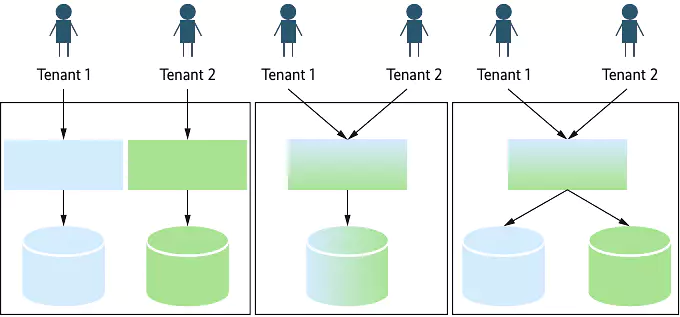
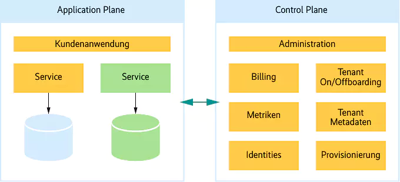

# Architecture

## Multi-tenant deployment following the Silo model

From a [recent Heise article](https://www.heise.de/en/background/Many-clients-one-system-multi-tenant-architecture-in-software-projects-10331322.html):

> [...]
> 
> ### Silos, pools and everything in between
> Multi-tenancy does not necessarily mean that the clients share all application resources and the entire infrastructure, but simply that the overall application is presented as a single product. The following models are therefore in use: the silo model, the pool model and hybrid forms of both, such as the bridge model (see Figure 1).
>
> 
> 
> The silo model assigns a dedicated infrastructure to each tenant, for example a database instance or a separate VM for the application logic. Even if the infrastructure is not particularly cost-efficient here, this approach has some advantages: Infrastructure costs can be easily allocated to each client and data isolation is automatic. Local developers treat the application as a single-tenant application. This results in a simpler migration path for existing applications launched as classic single-tenant products.
>
> One disadvantage, apart from the costs, is that admins have to provision infrastructure when onboarding tenants. This means that provisioning must be automated to avoid uncontrolled growth. Deploying updates also takes more time here, but allows successive rolling updates and canary releases.
>
> [ ... ommitted pool and bridge model ... ]
>
> ### The control plane and its tasks
> When designing a multi-tenant architecture, aspects such as data isolation or the scaling of services are typically the first things that come to mind. However, there are also numerous tasks relating to the lifecycle and operation of the clients, which the administrators have to manage in a standardized and centralized manner, regardless of the specialist area.
> 
> These tasks should be mapped by a control plane that works in parallel with the application (also known as the data or application plane in this context) (see Tod Golding: Building Multi-Tenant Saas Architectures; 2024). The more the number of tenants grows, the more important the control plane becomes to ensure central management of the clients.
>
> 
>
> Another function of the control plane is the onboarding of tenants. This generates metadata such as a tenant identifier, which allows requests to be routed correctly. In the case of a silo database, further metadata would be added, such as the connection parameters to the database. The specific infrastructure and configuration are then provisioned. In the case of automation, this builds a new database in the silo model and creates a new user pool for user identities, i.e. individual users within a tenant. An early, uniformly automated onboarding process makes sense, as otherwise the maintenance effort increases in the medium term and runs counter to the added value of multi-tenancy.
>
> User identities are relevant for the control plane insofar as it uses them to establish the tenant relationship and can therefore make tenant metadata available to the application plane.
> 
> A billing component of the control plane manages the billing plans of the customers and, if required, obtains usage statistics of the clients from the metrics component. Metrics and log aggregation are also important for client-specific usage and error analyses. To this end, the Application Plane services always provide a tenant ID for identification in logs and metrics.
>
> [...]

We currently have no control plane that manages multiple tenants inside a kubernetes cluster. 

- [ ] how can we make autoscaling a commercial feature?
- [ ] which parts of a deployment can be shared to increase cost efficiency?
      - antivirus? only a scanner, but how do we scale it? using kubernetes? horizontally?
      - tika? only a scanner, but how do we scale it? using kubernetes? horizontally?
      - collabora? https://sdk.collaboraonline.com/docs/installation/Kubernetes.html
      - nats? https://nats-io.github.io/k8s/helm/charts
      - keycloak? also requires postgres ...
      - ldap https://jp-gouin.github.io/helm-openldap/ ?

      tika and antivirus were not part of the ocis chart
      - tika supports autoscaling: https://artifacthub.io/packages/helm/apache-tika/tika
      - clamav uses opendesk: https://gitlab.opencode.de/bmi/opendesk/components/platform-development/charts/opendesk-clamav/-/tree/main/charts/opendesk-clamav ... but it requires RWM storage

