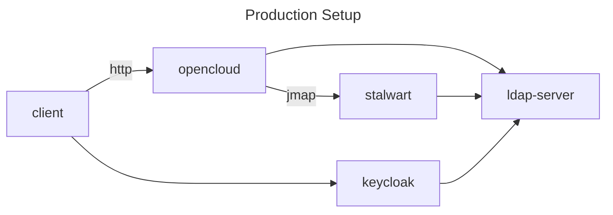
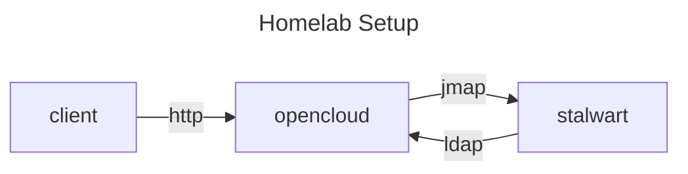

# Groupware Developer Guide

<!-- markdownlint-disable MD033 -->

## Introduction

The Groupware component of OpenCloud is implemented as a (micro)service within the OpenCloud framework (see `./services/groupware/`).

It is essentially providing a REST API to the OpenCloud UI clients (web, mobile) that is high-level and adapted to the needs of the UIs.

The implementation of that REST API turns those high-level APIs into lower-level [JMAP](https://jmap.io/) API calls to [Stalwart, the JMAP mail server](https://stalw.art/), using our own JMAP client library in `./pkg/jmap/` with a couple of additional RFCs used by JMAP in `./pkg/jscalendar` and `./pkg/jscontact`.

## Repository

The code lives in the same tree as the other OpenCloud backend services, albeit currently in the `groupware` branch, that gets rebased on `main` on a regular basis (at least once per week.)

Use [the `groupware` branch](https://github.com/opencloud-eu/opencloud/tree/groupware)

```bash
cd ~/src/opencloud/
OCDIR="$PWD"
git clone --branch groupware git@github.com:opencloud-eu/opencloud.git
```

Note that setting the variable `OCDIR` is merely going to help us with keeping the instructions below as generic as possible, it is not an environment variable that is used by OpenCloud.

### Tools Repository

Also, you might want to check out these [helper scripts in opencloud-tools](https://github.com/pbleser-oc/opencloud-tools) somewhere and put that directory into your `PATH`, as it contains scripts to test and build the OpenCloud Groupware:

```bash
cd "$OCDIR/"
git clone git@github.com:pbleser-oc/opencloud-tools.git ./bin
echo "export PATH=\"\$PATH:$OCDIR/bin\"" >> ~/.bashrc
```

#### Tools Prerequisites

Those scripts have the following prerequisites:

* the [`jq`](https://github.com/jqlang/jq) JSON query command-line tool to extract access tokens,
* either the [httpie](https://httpie.io/cli) (`pipx install httpie`) or [`xh`](https://github.com/ducaale/xh) (`cargo install xh --locked`) command-line HTTP clients, just out of convenience as their output is much nicer than curl's
* `curl` as well, to retrieve the access tokens from Keycloak (no need for nice output there)

## Configuration

Since we require having a Stalwart container running at the very least, the preferred way of running OpenCloud and its adjacent services for developing the Groupware component is by using the `opencloud_full` Docker Compose setup in `$OCDIR/opencloud/devtools/deployments/opencloud_full/`.

This section will explain how to configure that Docker Compose setup for the needs of the Groupware backend.

### Hosts

The default hostname domain for the containers is `.opencloud.test`

Make sure to have the following entries in your `/etc/hosts`:

```ruby
127.0.0.1       cloud.opencloud.test
127.0.0.1       keycloak.opencloud.test
127.0.0.1       wopiserver.opencloud.test
127.0.0.1       mail.opencloud.test
127.0.0.1       collabora.opencloud.test
127.0.0.1       traefik.opencloud.test
127.0.0.1       stalwart.opencloud.test
```

Alternatively, use the following shell snippet to extract it in a more automated fashion:

```bash
cd "$OCDIR/opencloud/devtools/deployments/opencloud_full/"

perl -ne 'if (/^([A-Z][A-Z0-9]+)_DOMAIN=(.*)$/) { print length($2) < 1 ? lc($1).".opencloud.test" : $2,"\n"}' <.env\
|sort|while read n; do\
grep -w -q "$n" /etc/hosts && echo -e "\e[32;4mexists :\e[0m $n: \e[32m$(grep -w $n /etc/hosts)\e[0m">&2 ||\
{ echo -e "\e[33;4mmissing:\e[0m ${n}" >&2; echo -e "127.0.0.1\t${n}";};\
done \
| sudo tee -a /etc/hosts
```

### Compose

There are two options, either

1. running the Groupware backend with OpenLDAP and Keycloak containers, more akin to a production setup;
2. running the Groupware backend using the built-in LDAP and OIDC services, for a minimalistic setup that uses less resources and is more likely to be found in a home lab setup.

In either case, the Docker Compose configuration in `$OCDIR/opencloud/devtools/deployments/opencloud_full/` needs to be modified.

#### Production Setup

<a name="prod-setup"></a>



Edit `$OCDIR/opencloud/devtools/deployments/opencloud_full/.env`, making the following changes (make sure to check out [the shell command-line that automates all of that, below](#automate-env-setup-prod)):

* change the container image to `opencloudeu/opencloud:dev`:

```diff
-OC_DOCKER_IMAGE=opencloudeu/opencloud-rolling
+OC_DOCKER_IMAGE=opencloudeu/opencloud
-OC_DOCKER_TAG=
+OC_DOCKER_TAG=dev
```

* add the `groupware` service to `START_ADDITIONAL_SERVICES`:

```diff
-START_ADDITIONAL_SERVICES="notifications"
+START_ADDITIONAL_SERVICES="notifications,groupware"
```

* enable the OpenLDAP container:

```diff
-#LDAP=:ldap.yml
+LDAP=:ldap.yml
```

* enable the Keycloak container:

```diff
-#KEYCLOAK=:keycloak.yml
+KEYCLOAK=:keycloak.yml
```

* enable the Stalwart container:

```diff
-#STALWART=:stalwart.yml
+STALWART=:stalwart.yml
```

* optionally disable the Collabora container

```diff
-COLLABORA=:collabora.yml
+#COLLABORA=:collabora.yml
```

* optionally disable UI containers

```diff
-UNZIP=:web_extensions/unzip.yml
-DRAWIO=:web_extensions/drawio.yml
-JSONVIEWER=:web_extensions/jsonviewer.yml
-PROGRESSBARS=:web_extensions/progressbars.yml
-EXTERNALSITES=:web_extensions/externalsites.yml
+#UNZIP=:web_extensions/unzip.yml
+#DRAWIO=:web_extensions/drawio.yml
+#JSONVIEWER=:web_extensions/jsonviewer.yml
+#PROGRESSBARS=:web_extensions/progressbars.yml
+#EXTERNALSITES=:web_extensions/externalsites.yml
```

<a name="automate-env-setup-prod"></a>
All those changes above can be automated with the following script:

```bash
cd "$OCDIR/opencloud/devtools/deployments/opencloud_full/"
perl -pi -e '
  s|^(OC_DOCKER_IMAGE)=.*$|$1=opencloudeu/opencloud|;
  s|^(OC_DOCKER_TAG)=.*$|$1=dev|;
  s|^(START_ADDITIONAL_SERVICES=".*(?<!groupware))"|$1,groupware"|;
  s,^#(LDAP|KEYCLOAK|STALWART)=(.+)$,$1=$2,;
' .env
```

To disable Web UI services in case you are only interested in the backend service(s):

```bash
cd "$OCDIR/opencloud/devtools/deployments/opencloud_full/"
perl -pi -e '
  s|^([A-Z]+=:web_extensions/.*yml)$|#$1|;
  s,^(COLLABORA)=(.+)$,#$1=$2,;
' .env
```

#### Homelab Setup

<a name="homelab-setup"></a>



Edit `$OCDIR/opencloud/devtools/deployments/opencloud_full/.env`, making the following changes (make sure to check out [the shell command-line that automates all of that, below](#automate-env-setup-homelab)):

* change the container image to `opencloudeu/opencloud:dev`:

```diff
-OC_DOCKER_IMAGE=opencloudeu/opencloud-rolling
+OC_DOCKER_IMAGE=opencloudeu/opencloud
-OC_DOCKER_TAG=
+OC_DOCKER_TAG=dev
```

* enable the creation of demo users:

```diff
-DEMO_USERS=
+DEMO_USERS=true
```

* add the `groupware` service to `START_ADDITIONAL_SERVICES`:

```diff
-START_ADDITIONAL_SERVICES="notifications"
+START_ADDITIONAL_SERVICES="notifications,groupware"
```

* enable the Stalwart container:

```diff
-#STALWART=:stalwart.yml
+STALWART=:stalwart.yml
```

* while not required, it is recommended to enable basic authentication support which, while less secure, allows for easier tooling when developing and testing HTTP APIs, by adding `PROXY_ENABLE_BASIC_AUTH=true` somewhere before the last line of the `.env` file:

```diff
 # Domain of Stalwart
 # Defaults to "stalwart.opencloud.test"
 STALWART_DOMAIN=

+# Enable basic authentication to facilitate HTTP API testing
+# Do not do this in production.
+PROXY_ENABLE_BASIC_AUTH=true
+
 ## IMPORTANT ##
```

* optionally disable the Collabora container

```diff
-COLLABORA=:collabora.yml
+#COLLABORA=:collabora.yml
```

* optionally disable UI containers

```diff
-UNZIP=:web_extensions/unzip.yml
-DRAWIO=:web_extensions/drawio.yml
-JSONVIEWER=:web_extensions/jsonviewer.yml
-PROGRESSBARS=:web_extensions/progressbars.yml
-EXTERNALSITES=:web_extensions/externalsites.yml
+#UNZIP=:web_extensions/unzip.yml
+#DRAWIO=:web_extensions/drawio.yml
+#JSONVIEWER=:web_extensions/jsonviewer.yml
+#PROGRESSBARS=:web_extensions/progressbars.yml
+#EXTERNALSITES=:web_extensions/externalsites.yml
```

<a name="automate-env-setup-homelab"></a>
All those changes above can be automated with the following script:

```bash
cd "$OCDIR/opencloud/devtools/deployments/opencloud_full/"
perl -pi -e '
  BEGIN{$basic_auth=0}
  s|^(OC_DOCKER_IMAGE)=.*$|$1=opencloudeu/opencloud|;
  s|^(OC_DOCKER_TAG)=.*$|$1=dev|;
  s|^(START_ADDITIONAL_SERVICES=".*(?<!groupware))"|$1,groupware"|;
  s,^(DEMO_USERS)=.+,$1=true,;
  s,^#(STALWART)=(.+)$,$1=$2,;
  s,^#(PROXY_ENABLE_BASIC_AUTH)=(.*)$,$1=true,;
  $basic_auth=1 if /^PROXY_ENABLE_BASIC_AUTH=/;
  print "\n# Enable basic authentication to facilitate HTTP API testing\n# Do not do this in production.\nPROXY_ENABLE_BASIC_AUTH=true\n\n" if /^## IMPORTANT ##/ && !$basic_auth;
' .env
```

To disable Web UI services in case you are only interested in the backend service(s):

```bash
cd "$OCDIR/opencloud/devtools/deployments/opencloud_full/"
perl -pi -e '
  s|^([A-Z]+=:web_extensions/.*yml)$|#$1|;
  s,^(COLLABORA)=(.+)$,#$1=$2,;
' .env
```

## Building

Build the `opencloudeu/opencloud:dev` image first:

```bash
cd "$OCDIR/opencloud/"
make -C ./opencloud/ clean build dev-docker
```

If you see obscure JavaScript related errors, do this and then try the `make` command above again:

```bash
make -C ./opencloud/services/idp/ generate
make -C ./opencloud/ clean build dev-docker
```

## Running

And then either run everything from the Docker Compose `opencloud_full` setup:

```bash
cd "$OCDIR/opencloud/devtools/deployments/opencloud_full/"
docker compose up -d
```

### Running in an IDE in Production Setup

If you plan to make changes to the backend code base, it might be more convenient to do so from within VSCode, in which case you should run all the services from the Docker Compose setup as above, but stop the `opencloud` service container (as that one will be running from within your IDE instead):

```bash
cd "$OCDIR/opencloud/devtools/deployments/opencloud_full/"
docker compose stop opencloud
```

and then use the Launcher `OpenCloud server with external services` in VSCode.

### Running in an IDE in Homelab Setup

Or if you want to do so but using the [&ldquo;homelab&rdquo; setup](#homelab-setup), then the `opencloud` container needs to be kept running, as it also provides LDAP and OIDC services, as the `stalwart` container cannot access those services on the `opencloud` process that is running on the host (in the IDE.)

In VSCode, use the Launcher `OpenCloud server` instead.

## Checking Services

To check whether the various services are running correctly:

### LDAP

#### Production Setup LDAP

When using the &ldquo;production&rdquo; setup (as depicted in section [Production Setup](#prod-setup) above), queries can be performed directly against the \
OpenLDAP container (`opencloud_full-openldap-1`) since its LDAP ports are mapped onto the host (to `:389` and `:636` for LDAP and LDAPS, respectively).

When using the OpenLDAP container, the necessary LDAP parameters are as follows:

* <u>Bind DN:</u> `cn=admin,dc=opencloud,dc=eu`
* <u>Bind Password:</u> `admin`
* <u>Base DN:</u> `ou=users,dc=opencloud,dc=eu`
* <u>Host:</u> `localhost`
* <u>LDAP Port:</u> `389`
* <u>LDAPS Port:</u> `636`

Run the following command on your host (requires the `ldap-tools` package with the `ldapsearch` CLI tool), which should output a list of DNs of demo users:

```bash
ldapsearch -h localhost -D 'cn=admin,dc=opencloud,dc=eu' \
-x -w 'admin' -b 'ou=users,dc=opencloud,dc=eu' -LLL \
'(objectClass=person)' dn
```

Sample output:

```ldif
dn: uid=alan,ou=users,dc=opencloud,dc=eu

dn: uid=lynn,ou=users,dc=opencloud,dc=eu

dn: uid=mary,ou=users,dc=opencloud,dc=eu

dn: uid=admin,ou=users,dc=opencloud,dc=eu

dn: uid=dennis,ou=users,dc=opencloud,dc=eu

dn: uid=margaret,ou=users,dc=opencloud,dc=eu

```

#### Homelab Setup LDAP

Instead, when using the &ldquo;homelab&rdquo; setup (as depicted in section [Homelab Setup](#homelab-setup) above), queries cannot be performed directly from the host \
but, instead, require spinning up another container in the same Docker network and do so from there.

The necessary LDAP parameters are as follows:

* <u>Bind DN:</u> `uid=libregraph,ou=sysusers,o=libregraph-idm`
* <u>Bind Password:</u> `admin` (or whichever password is set in the `IDM_REVASVC_PASSWORD` environment variable in `opencloud.yml`)
* <u>Base DN:</u> `o=libregraph-idm`
* <u>Host:</u> `localhost`
* <u>LDAP Port:</u> none, only supports LDAPS
* <u>LDAPS Port:</u> `9235`

To access the LDAP tree, spawn a new container in the same network, e.g. like this for a Debian 12 container:

```bash
docker run --network 'opencloud_full_opencloud-net' --rm \
--name "debian-${RANDOM}" -ti 'debian:12'
```

In that container, install the necessary packages to have the LDAP command-line tools:

```bash
apt-get update -y && apt-get install -y ca-certificates ldap-utils
```

Run the following command in that container, which should output a list of DNs of demo users:

```bash
LDAPTLS_REQCERT=never ldapsearch -H ldaps://opencloud:9235 \
-D 'uid=reva,ou=sysusers,o=libregraph-idm' -x -w 'admin' \
-b 'o=libregraph-idm' -LLL \
'(objectClass=person)' dn
```

> [!NOTE]
> The `LDAPTLS_REQCERT` environment variable is set to `never` to prevent the `ldapsearch` application to validate the TLS certificate of the LDAP server, since we are using self-signed certificates for all those services in the devtools setups.

Sample output:

```ldif
dn: uid=admin,ou=users,o=libregraph-idm

dn: uid=alan,ou=users,o=libregraph-idm

dn: uid=lynn,ou=users,o=libregraph-idm

dn: uid=mary,ou=users,o=libregraph-idm

dn: uid=margaret,ou=users,o=libregraph-idm

dn: uid=dennis,ou=users,o=libregraph-idm

```

Alternatively, as a one-liner using an Alpine Docker image:

```bash
docker run --network 'opencloud_full_opencloud-net' --rm -ti alpine:3 \
/bin/sh -c "apk update && apk add openldap-clients && exec /bin/sh -il"
```

### Testing Keycloak

> [!NOTE]
> Only available in the [&ldquo;production&rdquo; setup](#prod-setup)

To check whether it works correctly, the following `curl` command:

```bash
curl -ks -D- -X POST \
"https://keycloak.opencloud.test/realms/openCloud/protocol/openid-connect/token" \
-d username=alan -d password=demo -d grant_type=password \
-d client_id=groupware -d scope=openid
```

should provide you with a JSON response that contains an `access_token` property.

If it is not set up correctly, it should give you this instead:

```json
{"error":"invalid_client","error_description":"Invalid client or Invalid client credentials"}
```

### Testing Stalwart

To then test the IMAP authentication with Stalwart, run the following command on your host (requires the `openssl` CLI tool):

```bash
openssl s_client -crlf -connect localhost:993
```

When then greeted with the following prompt:

```java
* OK [CAPABILITY ...] Stalwart IMAP4rev2 at your service.
```

enter the following command:

```bash
A LOGIN alan demo
```

to which one should receive the following response:

```java
A OK [CAPABILITY IMAP4rev2 ...] Authentication successful
```

## Feeding an Inbox

Once a [Stalwart](https://stalw.art/) container is running (using the Docker Compose setup as explained above), use [`imap-filler`](https://github.com/opencloud-eu/imap-filler/) to populate the inbox folder via [`IMAP APPEND`](https://www.rfc-editor.org/rfc/rfc9051.html#name-append-command):

```bash
cd "$OCDIR/"
git clone git@github.com:opencloud-eu/imap-filler.git
cd ./imap-filler/
go run . --username=alan --password=demo \
  --url=localhost:993 \
  --empty=true \
  --folder=Inbox \
  --senders=6 \
  --count=50
```

> [!NOTE]
> Note that this operation does not use the Groupware APIs or any other OpenCloud backend services either,
> as it directly communicates with Stalwart via IMAPS on port `993` which is mapped on the host.

For more details on the usage of that little helper tool, consult its [`README.md`](https://github.com/opencloud-eu/imap-filler/blob/main/README.md), although it is quite self-explanatory.

> [!NOTE]
> This only needs to be done once, since the emails are stored in a volume used by the Stalwart container.

## Setting up Stalwart Principals

To make things more interesting, we might want to create some resources that are currently not captured by our LDAP structure and/or not part of our demo users, such as by

 * adding quota to users, to have quota limits show up in the JMAP payloads;
 * add groups, to have them listed as additional accounts for the users that are members of those groups;
 * add mailing-lists

Those things can either be done using the Stalwart administration web UI, manually, or by using its [Management API](https://stalw.art/docs/api/management/endpoints/).

For the latter, we have another helper tool that has the ability, among a few other things, to take a file with a desired state and apply the necessary changes accordingly to the current state.

```bash
cd "$OCDIR/"
git clone git@github.com:opencloud-eu/stalwart-admin.git
cd ./stalwart-admin/
go run . principal import --log-level=info --activate -f "$OCDIR/opencloud/services/groupware/demo-principals.yaml"
```

## Setting Quota in Stalwart

Use the [Stalwart Management API](https://stalw.art/docs/category/management-api) to set the quota for a user if you want to test quota-related Groupware APIs.

Note that users that exist in OpenCloud (specifically in the LDAP, be it OpenLDAP or the built-in IDM) are only visible in Stalwart after they have been authenticated successfully once, e.g. by retrieving a [JMAP Session](https://jmap.io/spec-core.html#the-jmap-session-resource), which can be performed using the helper script `oc-st-session` (which uses the environment variable `username` to determine the username), or using `curl` directly as follows:

```bash
curl -L -k -s -u alan:demo https://stalwart.opencloud.test/.well-known/jmap
```

The following examples perform operations on the user `alan`.

### Display current Quota

```bash
curl -k -s -u mailadmin:admin https://stalwart.opencloud.test/api/principal/alan | jq
```

### Modify current Quota

We will change the quota to 256 MB, and since the value is in bytes:

```bash
value=$(( 256 * 1024 * 1024 ))
curl -k -s -u mailadmin:admin -X PATCH https://stalwart.opencloud.test/api/principal/alan -d '[{"action":"set", "field":"quota", "value":'${value}'}]'
```

## Building after Changes

If you run the `opencloud` service as a container, use the following script to update the container image and restart it:

```bash
oc-full-update
```

If you prefer to do so without that script:

```bash
cd "$OCDIR/opencloud/"
make -C opencloud/ clean build dev-docker
cd devtools/deployments/opencloud_full/
docker compose up -d opencloud
```

If you run it from your IDE, there is obviously no need to do that.

## API Docs

The REST API documentation is extracted from the source code structure and documentation using [`go-swagger`](https://goswagger.io/go-swagger/), which needs to be installed locally as a prerequisite:

```bash
go install github.com/go-swagger/go-swagger/cmd/swagger@latest
```

The build chain is integrated within the `Makefile` in `services/groupware/`:

```bash
cd "$OCDIR/opencloud/services/groupware/"
make apidoc-static
```

That creates a static documentation HTML file using [redocly](https://redocly.com/) named `api.html`

```bash
firefox ./api.html
```

Note that `redocly-cli` does not need to be installed, it will be pulled locally by the `Makefile`, provided that you have [pnpm](https://pnpm.io/) installed as a pre-requisite, which is already necessary for other OpenCloud components.

## Testing

This section assumes that you are using the [helper scripts in opencloud-tools](https://github.com/pbleser-oc/opencloud-tools) as instructed above.

Your main swiss army knife tool will be `oc-gw` (mnemonic for "OpenCloud Groupware").

As prerequisites, you should have `curl` and either [`http`(ie)](https://httpie.io/cli) or [`xh`](https://github.com/ducaale/xh) installed, in order to have a modern CLI HTTP client that is more helpful than plain old `curl`.

* `http` can be installed as follows: `pipx install httpie`,
* while `xh` can be installed as follows: `cargo install xh --locked`

As for credentials, `oc-gw` defaults to using the user `alan` (with the password `demo`), which can be changed by setting the following environment variables:

* `username`
* `password`

Example:

```bash
username=margaret password=demo oc-gw //accounts/all/quotas
```

To set them more permanently for the lifetime of a shell:

```bash
export username=lynn
export password=demo

oc-gw //accounts/all/mailboxes

oc-gw //accounts/all/mailboxes/roles/inbox
```

The `oc-gw` script does the following regarding authentication:

* checks whether a container named `opencloud_full-opencloud-1` is running locally
  * if so, whether it has basic auth enabled or not
    * if yes, uses basic auth directly to authenticate against the OpenCloud Proxy service that ingresses for the OpenCloud Groupware backend, using the credentials defined in the environment variables `username` and `password` (defaulting to `alan`/`demo`)
    * if not, always retrieves a fresh access token from Keycloak, using the credentials defined in the environment variables `username` and `password` (defaulting to `alan`/`demo`), using the "Direct Access Grant" OIDC API of Keycloak and then use that JWT for Bearer authentication against the OpenCloud Groupware REST API
  * if no such container is running locally, it assumes that the `opencloud` process is running from within an IDE, with its OpenCloud Proxy service listening on `https://localhost:9200`

It will also save you some typing as whenever you use `//` for the URL, it will replace that by the Groupware REST API base URL, e.g.

```bash
oc-gw //accounts
```

will be translated into

```bash
http https://cloud.opencloud.test/groupware/accounts
```

The first thing you might want to test is to query the index, which will ensure everything is working properly, including the authentication and the communication between the Groupware and Stalwart:

```bash
oc-gw //
```

Obviously, you may use whichever HTTP client you are most comfortable with.

Here is how to do it without the `oc-gw` script, using [`curl`](https://curl.se/):

When using the &ldquo;production&rdquo; setup, first make sure to retrieve a JWT for authentication from Keycloak:

```bash
token=$(curl --silent --insecure --fail -X POST \
"https://keycloak.opencloud.test/realms/openCloud/protocol/openid-connect/token" \
-d username="alan" -d password="demo" \
-d grant_type=password -d client_id="groupware" -d scope=openid \
| jq -r '.access_token')
```

Then use that token to authenticate the Groupware API request:

```bash
curl --insecure -s -H "Authorization: Bearer ${token}" "https://cloud.opencloud.test/groupware/"
```

When using the &ldquo;homelab&rdquo; setup, authenticate directly using basic auth:

```bash
curl --insecure -s -u "alan:demo" "https://cloud.opencloud.test/groupware/"
```

> [!TIP]
> Until everything is documented, the complete list of URI routes can be found in \
[`$OCDIR/opencloud/services/groupware/pkg/groupware/groupware_route.go`](./pkg/groupware/groupware_route.go)

## Services

### Stalwart

#### Web UI

To access the Stalwart admin UI, open <https://stalwart.opencloud.test/> and use the following credentials to log in:

* username: `mailadmin`
* password: `admin`

The usual admin username `admin` had to be changed into `mailadmin` because there is already an `admin` user that ships with the default users in OpenCloud, and Stalwart always checks the LDAP directory before its internal usernames.

Those credentials are configured in `devtools/deployments/opencloud_full/config/stalwart/config.toml`:

```ruby
authentication.fallback-admin.secret = "$6$4qPYDVhaUHkKcY7s$bB6qhcukb9oFNYRIvaDZgbwxrMa2RvF5dumCjkBFdX19lSNqrgKltf3aPrFMuQQKkZpK2YNuQ83hB1B3NiWzj."
authentication.fallback-admin.user = "mailadmin"
```

#### Restart from Scratch

To start with a Stalwart container from scratch, removing all the data (including emails):

```bash
cd "$OCDIR/opencloud/devtools/deployments/opencloud_full"
docker compose rm stalwart --stop
docker volume rm opencloud_full_stalwart-data
docker compose up -d stalwart
```

#### Diagnostics

If anything goes wrong, the first thing to check is Stalwart's logs, that are configured on the most verbose level (trace) and should thus provide a lot of insight:

```bash
docker logs -f opencloud_full-stalwart-1
```
